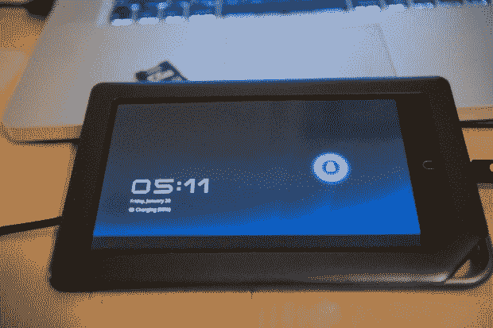

# Android 3.0 在 Nook Color TechCrunch 上运行不佳

> 原文：<https://web.archive.org/web/https://techcrunch.com/2011/01/28/android-3-0-running-poorly-on-nook-color/>

# Android 3.0 在 Nook Color 上运行不佳

Android 3.0 (Honeycomb)最近刚刚发布了第一个[SDK](https://web.archive.org/web/20221206152354/http://www.mobilecrunch.com/2011/01/26/google-releases-preview-version-of-honeycomb-sdk-gives-overview-of-tablet-features/)，看起来 Android 社区中有魄力的黑客已经[将其](https://web.archive.org/web/20221206152354/http://forum.xda-developers.com/showthread.php?t=930223)移植到 Nook Color 硬件上了。嗯，部分是。这是一个由 SDK 和 Nook 的内核混合而成的“僵尸”，它像狗一样运行。下一步是让硬件加速(Honeycomb 中 UI 快速性的主要部分)工作起来，XDA 的黑客 dhoshman 说他将在周末致力于此。我们会随时通知你最新进展。