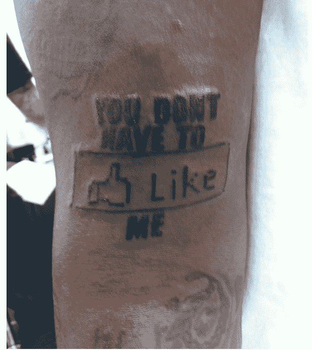

# 说唱歌手 T-Pain 纹了一个“类似脸书”的纹身

> 原文：<https://web.archive.org/web/http://techcrunch.com/2011/01/28/rapper-t-pain-gets-a-facebook-like-tattoo/>

# 说唱歌手 T-Pain 纹了一个“类似脸书”的纹身

不管怎样，今天是周五:看起来美国歌手兼说唱歌手 T-Pain(真名:法希姆·拉希德·纳札)在夏威夷[的时候](https://web.archive.org/web/20230326025334/http://twitpic.com/3u2fe2)给自己[纹了个纹身](https://web.archive.org/web/20230326025334/http://www.rap-up.com/2011/01/28/t-pain-shares-facebook-tattoo/)。

他在推特上生动地讲述了这件事:“我每次来夏威夷都会纹身。我认为这个很可爱，除非 facebook 很快关闭 0_o”

我真的没有什么可以补充的，除了我对他的新纹身没什么印象。幸运的是，我不必喜欢它。

相关:[以色列男子在二头肌上纹身 YouTube 标志。查德·赫利略有印象](https://web.archive.org/web/20230326025334/https://techcrunch.com/2009/12/09/israeli-man-tattoos-youtube-logo-on-bicep-chad-hurley-mildly-impressed/)

**更新:**奖励视频——我们的 Greg Kumparak [在 CES 上采访 T-Pain](https://web.archive.org/web/20230326025334/http://ces.crunchgear.com/2011/01/greg-talks-to-t-pain-about-the-new-i-am-t-pain-microphone/) :