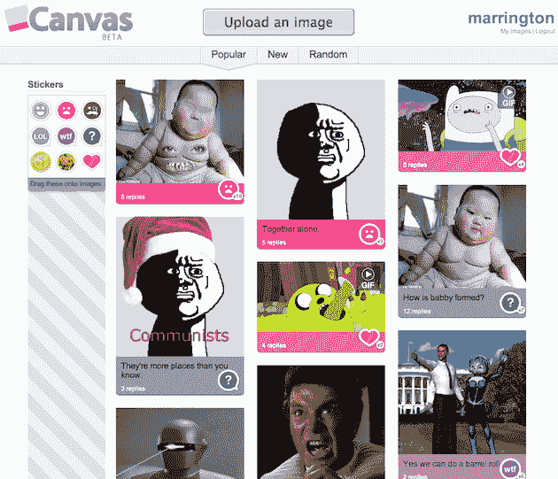
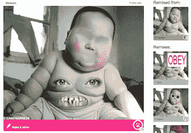

# 4chan 创始人在世界上展开画布 TechCrunch

> 原文：<https://web.archive.org/web/https://techcrunch.com/2011/01/31/4chan-founder-unleases-canvas-networks/>

[画布](https://web.archive.org/web/20230216134700/http://canv.as/)今天为大约 4000 名幸运儿推出。

7 岁的 [4chan](https://web.archive.org/web/20230216134700/http://www.4chan.org/) ，由现在 23 岁的[克里斯托弗·普尔](https://web.archive.org/web/20230216134700/http://www.crunchbase.com/person/christopher-poole)创作，继续让互联网欣喜若狂。主要的网络迷因要么是在 4chan 上[创造的，要么是在 4chan 上](https://web.archive.org/web/20230216134700/http://en.wikipedia.org/wiki/4chan#Memes)传播的，正如我们数不清的更多的拒绝服务攻击一样。每个月大约有 1200 万人访问这个网站，任何时候 4chan 上都有 60，000 到 70，000 人。

Poole 说，chan 的成功基于三点。当访问者反复讨论发布的内容(通常是图片)时，可以进行实时协作。一个真实的共享体验作为一个项目在 4chan 上弹出，然后最终从板上掉下来(没有存档)。流动身份——要在 4Chan 上添加内容，你所要做的就是写点东西，上传一个文件，完成一个验证码。没有用户帐户。

但 4chan 并不是 Poole 的最终目标。他把那里的东西拿来，改变了其他东西，创造了全新的东西——[画布](https://web.archive.org/web/20230216134700/http://canv.as/)。

我们从去年年初就知道了这家初创公司，当时有消息透露，有顶级投资者参与了一轮小规模融资。但是直到现在，很少有人能够真正看到这个地方。包括普尔在内的四人小组一直在努力工作并保持安静。

然而今天，几千个在过去几个月里请求测试版邀请的人将可以访问该网站。随着时间的推移，将会批量添加更多的人，最初请求帐户的每个人最终都会收到一个邀请，邀请他们加入一个朋友。

那么什么是画布呢？像 4chan 一样，它是人们发布内容和开始讨论的地方。它与 4chan 有明显的相似之处——尽管内容被存档，人们创建账户。但是用户保持完全匿名。他们的个人资料页面只不过是他们添加到网站上的各种内容的集合。

画布从图像开始。像 Dailybooth 一样，用户上传一张图片，讨论就开始了。然而，Dailybooth 主要是关于人们上传自己的照片。很多很多他们自己的照片。在画布上，有很多 photoshopping 在进行，其中一些非常有趣。

以目前最热门的讨论为例，展示了一个非常胖的婴儿的照片。添加了很多很多的 PS 变体。

更多不经意的观众可以通过拖放可视图标——笑脸、LOL、WTF 等——添加到内容中。这创造了一种简单的方法来收集大量关于图像的元数据，并有助于将它在流行列表中向上或向下推。

Poole 说他们很快也会添加其他类型的内容——视频、音频、富文本。“这只是长期愿景的核心，Canvas 是关于合作的，”他说。"画布是关于发现、分享和玩耍的一切."

Canvas 是一个独立于 4chan 的实体，除了 Poole 之外没有任何联系。但我的猜测是，4chan 人群中有很多人可能会去画布上看一看。