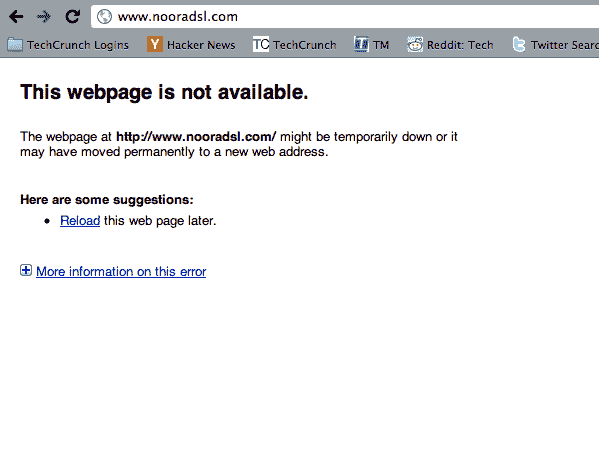

# 埃及关闭其最后一家 ISP Noor TechCrunch

> 原文：<https://web.archive.org/web/https://techcrunch.com/2011/01/31/reports-egypt-shutting-down-noor-its-last-isp/>

# 埃及关闭了其最后一个 ISP Noor

我们在推特上听到[报道](https://web.archive.org/web/20230205045028/http://search.twitter.com/search?q=noor)称 [Noor Group 的 DSL](https://web.archive.org/web/20230205045028/http://www.nooradsl.com/) 服务被关闭，这是埃及最后的 ISP[服务，为埃及证券交易所以及可口可乐和埃克森美孚等主要品牌的网站提供服务，这意味着该国将失去几乎所有剩余的与外界的高速连接。](https://web.archive.org/web/20230205045028/http://newsgrange.com/why-one-egyptian-isp-is-still-online/)

Jacob Applebaum 称，关闭是分阶段进行的，某些网站仍然在线，*“Noor . net 关闭了除 NTG 以外的所有网站，该国家技术集团为航空、银行和金融部门提供 IT 处理服务。”*ISP 网站本身离线。

http://twitter.com/#!/io error/status/32188095344410624

[有效措施](https://web.archive.org/web/20230205045028/http://www.effectivemeasure.com/)首席执行官 Scott Julian 证实，Noor 的流量已逐渐停止，最后两家 ISP 处于离线状态，*“有效措施是记录 Noor 在埃及时间昨晚 11 点至午夜的活跃流量，但从凌晨 12 点开始，我们没有 Noor IP 地址的活动会话，日志中也没有任何数据。”*

Julian 还指出，这些连接中断与上一批发生在同一时间，并认为这是一次精心组织的努力。据推测，拨号上网仍在使用，因为谷歌和推特刚刚在 http://twitter.com/speak2tweet 推出了语音转推服务。

**更新:**互联网监控服务 Rensys 正在[确认](https://web.archive.org/web/20230205045028/http://www.renesys.com/blog/2011/01/egypts-net-on-life-support.shtml)Noor 关闭。

Applebaum 在推特上发布了当前埃及网上 IPv6 地址的图表。努尔不在其中。

