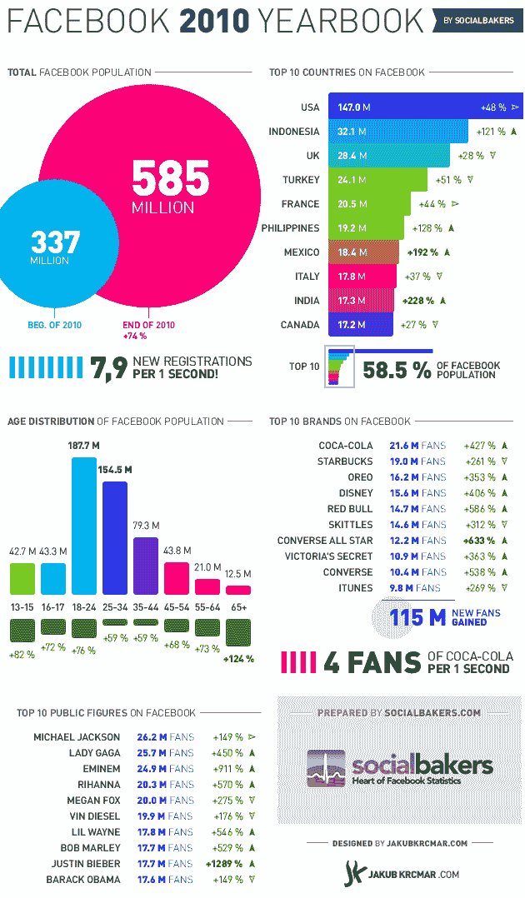

# 2010 年，脸书平均每秒钟有近 8 个新注册用户 TechCrunch

> 原文：<https://web.archive.org/web/http://techcrunch.com/2011/02/01/facebook-averaged-almost-8-new-registrations-per-second-in-2010/?utm_source=feedburner&utm_medium=feed&utm_campaign=Feed%3A+Techcrunch+(TechCrunch>&utm_content=Google+Feedfetcher)

# 2010 年，脸书平均每秒钟有 8 个新注册

一家捷克公司 Candytech 帮助公司创建和评估 T2 脸书 T3 的营销活动，多年来通过其统计门户网站 T4 social bakers T5 收集了大量脸书特有的数据。

该公司制作了这张很棒的信息图，提供了 2010 年脸书人口增长的概况。一些关键数据:

–脸书从 3.37 亿用户膨胀到 2010 年的 5.85 亿用户
–这意味着每年平均每秒就有大约 **7.9 个新用户注册
–美国和英国是排名前三的国家， 但是**印尼位居第二**，拥有 3210 万用户
——排名前 10 位的国家占据了近 60%的用户 **——绝大多数用户年龄在 18 至 34 岁之间**
——但是**增长最快的年龄组是 65 岁以上**(+124%)
——三个食品品牌(可口可乐、星巴克和奥利奥)占据了脸书的前三大品牌**

 ****