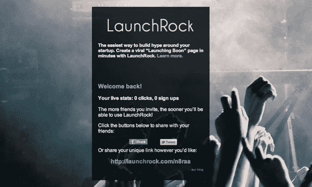
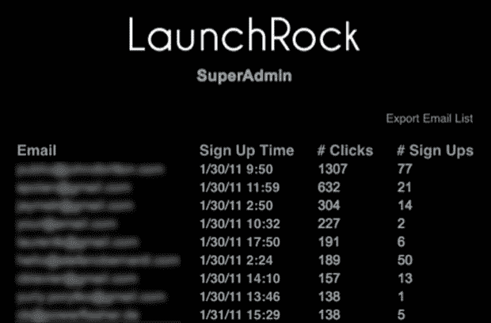

# 有史以来最元的创业公司 LaunchRock 建立了病毒式的启动页面 TechCrunch

> 原文：<https://web.archive.org/web/http://techcrunch.com/2011/02/01/launchrock-rocks-launches/?utm_source=feedburner&utm_medium=feed&utm_campaign=Feed:+Techcrunch+(TechCrunch>)

# 有史以来最元的初创公司 LaunchRock 建立了病毒式的启动页面

万一你需要[另一个](https://web.archive.org/web/20230202233435/https://techcrunch.com/2011/01/28/yuri-milner-sv-angel-offer-every-new-y-combinator-startup-150k/) *“你知道存在泡沫，当……”*科技邮报， [LaunchRock](https://web.archive.org/web/20230202233435/http://www.launchrock.com/) ，一家为其他初创公司建立病毒式启动页面的初创公司，今天通过自己的产品推出。受 [Fork.ly](https://web.archive.org/web/20230202233435/http://www.fork.ly/) 和 [Hipster](https://web.archive.org/web/20230202233435/http://www.usehipster.com/) 的[病毒式启动](https://web.archive.org/web/20230202233435/https://techcrunch.com/2011/01/17/hipster-2/)页面的启发，LaunchRock 背后的家伙认为他们可以简化让用户注册创业测试版的过程，并建立了一个完整的启动页面构建平台。

联合创始人 Jameson Detweiler 解释说，根据用户邀请的朋友数量，让用户更早获得产品的系统的优势在于，它向你显示需求水平，并允许你建立一个最热切的候选人名单。使用这种类型的页面，local Q &一个网站潮人带来了超过 10K 的注册，而没有提到它是做什么的。

*“邀请码模型坏了。你可以分发 1000 个，让它们在 TechCrunch 上消失，只有 50 人(或更少)真正使用这个网站。“有了 LaunchRock，人们就会表现出他们真的很想加入。”*

LaunchRock 是在周六的创业周末建立的，已经收到了 1000 多个注册，今天有 25 人进入测试版，其中 10 人是 TechCrunch 的读者。对 LaunchRock 的访问为您提供了构建您的启动页面的后端、设置您的@ A 记录的 IP 地址、与您的朋友分享的唯一链接，以及对 LaunchRock 分析服务的访问。

他们已经收到了重量级人物的兴趣，比如在产品发布会上使用棚车。Flowtown 的联合创始人丹·马爹利用它作为他的加拿大创业电子邮件列表 [Maplebutter 的注册页面。](https://web.archive.org/web/20230202233435/http://www.maplebutter.com/)

Detweiler 说，*“我上一次启动([http://greenkonnect.com](https://web.archive.org/web/20230202233435/http://greenkonnect.com/))的方式是错误的，花了太多的时间来构建，却不知道观众是否在那里，当我们准备好启动它时，我们没有任何人来使用它，然后很难找到人来使用它。”*

在 LaunchRock.com[网站](https://web.archive.org/web/20230202233435/http://www.launchrock.com/)上注册并希望立即访问的 TechCrunch 读者可以将他们的推荐链接发至 [@getlaunchrock](https://web.archive.org/web/20230202233435/http://www.twitter.com/getlaunchrock) ，并附上文字循环“RockLaunch Rocks Launches！”在今天的第 10 个之后，LaunchRock 将会让 TC 的读者分批通过，每批 5 个。

除了想出在启动后留住初创公司的方法，LaunchRock 还计划推出一个小工具，这样你就可以在自己的登录页面上使用 LaunchRock，提供优质服务和潜在的联盟计划作为一种商业模式。

