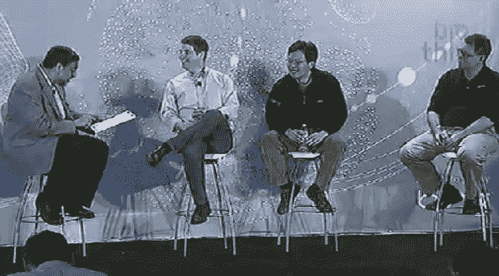
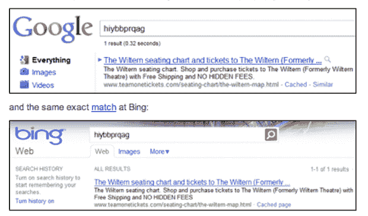

# 微软称谷歌的作弊例子为“极端异常值”

> 原文：<https://web.archive.org/web/http://techcrunch.com/2011/02/01/microsoft-calls-googles-cheating-examples-outlier/?utm_source=feedburner&utm_medium=feed&utm_campaign=Feed%3A+Techcrunch+(TechCrunch>)

# 微软称谷歌的作弊例子为“极端异常值”

今天早上，在 BigThink 大会上的“谁将赢得垃圾邮件战争”圆桌会议上，谷歌的马特·卡茨、必应的哈里·萨姆和 Blekko 的里奇·斯克伦塔聚在一起讨论搜索市场最近发生的戏剧性转折，最引人注目的是谷歌今天指控必应使用从 ie 浏览器和必应工具栏收集的谷歌用户数据来改善自己的搜索结果。

卡茨不同意微软的声明，即他们没有抄袭谷歌的结果，“微软说他们没有抄袭谷歌的结果，我们有截图可以证明这一点。”从丹尼·沙利文的帖子来看，必应确实在用谷歌的数据裁剪搜索结果，因为谷歌的蜜罐无意义查询几周后就出现在了必应上。见下文:

“谷歌工程师帮助我们发现了一种新形式的垃圾邮件。“我希望谷歌的工程师们在出版之前能和我们分享这些，”【Shum 说。他继续说，*“如果你看看每个搜索引擎是如何排列结果的，马特·卡茨指的是一些异常的例子。我们实际上并没有复制任何东西。我们实际上是在向顾客学习。你的意思是谷歌拥有这些数据吗？”*

卡茨对此显然有异议，[暗示](https://web.archive.org/web/20230203033137/http://searchengineland.com/google-bing-is-cheating-copying-our-search-results-62914)抄袭超出了其综合搜索实验所证明的范围，*“我们看到谷歌搜索结果出现在许多不同的查询中，不仅仅是综合查询，还有许多不同的查询。”*然后，*“我们不使用必应用户在谷歌排名上的点击量。”*

后来在小组讨论会上，卡茨似乎仍然对微软的回应感到震惊，*“我做搜索已经十年了，这是我第一次看到这样的事情。”*

 *Shum [发布了一份公开声明，回顾了他的许多谈话要点，但也加强了对 Bing 抄袭的明确否认。](https://web.archive.org/web/20230203033137/http://www.bing.com/community/site_blogs/b/search/archive/2011/02/01/thoughts-on-search-quality.aspx)

> 明确地说，我们向所有客户学习。我们在今天的故事中看到的是一个间谍小说式的特技，在尾部查询排名中产生极端的离群值。这是一个竞争对手的创造性策略，我们将把它作为一种间接的赞美。但它没有准确描述我们如何将选择加入的客户数据作为帮助改善用户体验的众多输入之一。”

随着搜索引擎大战愈演愈烈，必应抄袭谷歌的纠纷成了最新的战场。正如小组主持人和 TC 撰稿人 Vivek Wadhwa 所指出的，有趣的是，我们生活的这个世界，谷歌现在是垄断者，微软现在是竞争者，而 Blekko 是墙上的一只苍蝇。*