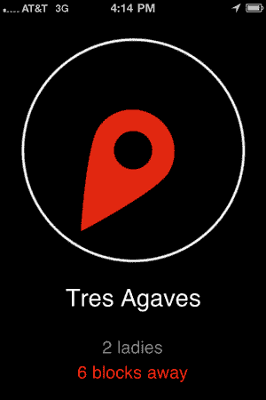

# 需要尽快找到女士们吗？theladies.at 最终登陆应用商店 TechCrunch

> 原文：<https://web.archive.org/web/http://techcrunch.com/2011/02/01/where-the-ladies-at-mobile/?utm_source=feedburner&utm_medium=feed&utm_campaign=Feed%3A+Techcrunch+(TechCrunch>&utm_content=Google+Reader)

# 需要尽快找到女士们吗？theladies.at 最终登陆应用商店

地理位置已经到了这种地步:经过三周的审查， [Wheretheladies.at](https://web.archive.org/web/20230202234045/http://wheretheladies.at/) ，一个按女性性别汇总 Foursquare 签到的网络应用，现在可以在 iPhone 上使用了。一个大指南针为你指出女士们的方向的概念是如此前所未有，以至于苹果公司在审查过程中实际上打电话给联合创始人[杰夫·霍兹登](https://web.archive.org/web/20230202234045/http://www.crunchbase.com/person/jeff-hodsdon)的手机询问这款应用的情况。

由 Path 的 Danny Trinh 和 Hodsdon 共同创建的 iPhone 应用程序 Wheretheladies.at 根据入住的女性数量对附近的位置进行排名(当性别不可用时，使用字典抓取和排列逻辑)，并为您指出您附近的女性临界质量的方向。

我们[以前](https://web.archive.org/web/20230202234045/https://techcrunch.com/2010/10/02/wheretheladies-at-shows-you-where-the-ladies-are-at/)称[这个](https://web.archive.org/web/20230202234045/https://techcrunch.com/2010/10/02/wheretheladies-at-shows-you-where-the-ladies-are-at/)服务*为“进化优势”，因为它本质上是书呆子利用技术来规避达尔文主义。最适者现在包括那些聪明的人，或者至少是智能手机。*

 *Hodsdon 说，Wheretheladies.at 和像[这样的应用程序之间的差异是暂时的。Wheretheladies.at 只统计过去 30 分钟内的入住人数，以确保当您到达时，女士们会在那里，*“当它说 10 位女士在 Elbo Room 时，这意味着在过去 30 分钟内。我认为这是关键。这关系到现在该往哪里走。”*](https://web.archive.org/web/20230202234045/http://www.assistedserendipity.com/)

目前该应用程序只在旧金山运行，但该团队正在努力将其推广到其他城市。当我问他们是否会在哪里建房子时，霍兹顿很快回答道，“我现在就开始。”

**更新:**霍兹登在这个帖子发布后几秒钟给我发了电子邮件，*“哦！忘记补充了！我们今晚要出去庆祝一下。哪里是女性的首选，我们就去哪里:)更新也来自 [@wheretheladies](https://web.archive.org/web/20230202234045/http://www.twitter.com/) ”*

你可以在这里下载应用程序[来找到他们在哪里。](https://web.archive.org/web/20230202234045/http://itunes.apple.com/us/app/where-the-ladies-at/id415602400?mt=8&ls=1)*