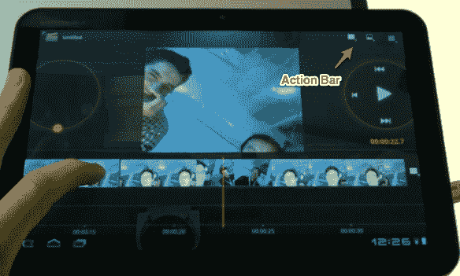

# 使用谷歌 iPad 竞争对手 TechCrunch Android Honeycomb 的第一印象

> 原文：<https://web.archive.org/web/http://techcrunch.com/2011/02/02/android-honeycomb-ipad/>

今天早上，谷歌[在](https://web.archive.org/web/20230203001210/https://techcrunch.com/2011/02/02/live-from-googles-android-honeycomb-event/)举办了一场活动，展示 Android Honeycomb，这是专注于平板电脑的新版移动操作系统。围绕该操作系统没有太多的消息——我们已经在一些演示中看到了它的预览——但该团队确实展示了 Honeycomb 的一些最巧妙的功能，如小部件和改进的 3D 渲染引擎。

但是实际上*使用*的平板电脑操作系统呢？尽管我们看到了很多精彩的预览，但很少有人真正写下使用这些平板电脑的感受。不幸的是，今天的活动也不是进行全面实践的理想场所——有几十名记者，只有四台平板电脑(大多数人只能玩一台五分钟)。但是我想把蜂巢填满，所以我留了下来，直到人群最终消失，戴上眼罩，开着摩托罗拉 Xoom 兜了 20 多分钟。向在我后面等着的人道歉——老实说，我不知道你在那儿。

这里有一些突出的功能和应用程序——一定要看看下面的视频，看看这些功能和应用程序的运行情况。

**动作栏**

 **【YouTube = http://www . YouTube . com/watch？v=p4mbz_bzPls&w=640&h=390]

最大的变化之一是从专用的硬件按钮访问菜单选项转移到“操作栏”，这是一个位于屏幕顶部的用户界面元素，其选项根据您使用的应用程序而变化。

如果你在平板电脑的浏览器中(基于谷歌 Chrome ),那么在这里你可以找到你打开的标签页。如果你在电影编辑应用程序中，你会在那里找到导入新剪辑的按钮，但如果你将手指按住剪辑的一部分，那么操作栏将填充添加过渡或文本覆盖的选项。换句话说，动作栏会根据您在应用程序中的操作而动态变化。

大多数应用程序还在操作栏的最右边包含一个设置按钮，尽管这只是惯例而不是规则。

在实践中，这个系统似乎工作得很好，你会发现，每当你想找到一个不属于主 UI 的应用程序选项或设置时，你会本能地看向动作栏。当然，开发人员可以完全控制动作栏中显示的内容，所以可能会有一些一致性问题。但至少人们实际上能够*找到*这些选项，这比在当前版本的 Android 上隐藏在“菜单”按钮后面的选项(许多人从未点击过)要多得多。

**浏览器**

把 iPad 的浏览器踢飞了。标签页很棒，平板电脑浏览器与桌面版谷歌浏览器同步也很好。滚动感觉很流畅。还有隐姓埋名模式。

**Gmail**

我们已经看过几次展示了，但 Honeycomb 的 Gmail 非常棒——它就像 iPad 优化的网页版 Gmail，但没有你在浏览器应用程序上仍然会发现的轻微滞后。我非常想要它。

**复制粘贴**

我从来没有像那些花时间抱怨它在 web 上的实现的人那样关心复制和粘贴。但是我知道你在那里，所以这里有一些好消息:它在蜂巢上工作得很好。

如果你用过 Android 姜饼，你应该已经熟悉高亮显示文本时出现的橙色箭头。这些功能运行得很好，但是有一个问题:没有按钮来选择你想要对文本做什么(解决方案是简单地点击突出显示的文本，这将它复制到剪贴板，但是某种菜单覆盖会很好)。

Honeycomb 的情况要好得多:当您突出显示文本时，操作栏会从当前选项变为允许您剪切、复制、粘贴或全选。刺激吗？一点也不。但是这是一个很好的例子，说明了动作栏是如何根据你正在做的事情而变化的，我相信你们中的一些人会对此感到欣喜若狂。

**安卓市场**

Android Market 的用户界面已经针对平板电脑进行了改进。我认为它非常难看:“Android Green”条纹感觉就像占位符图形，看起来远不如 iOS 的应用商店有吸引力。但它完成了任务。

**电影工作室**

它还没有得到太多的报道，但有一个新的应用程序作为谷歌应用程序蜂巢套件的一部分:电影工作室。我没有在这上面花太多时间，但是它包含了你所期望的特性:剪辑之间的过渡、文本叠加等等。用户界面不是你所说的漂亮，可能会让一些人摸不着头脑，但它是一个很好的应用程序。

**演出**

总的来说，蜂巢感觉很快——你可以在视频中看到，从来没有真正的任何滞后。我确实注意到在拖动小部件时会有一些轻微的抖动，但是后来我看到了一个更新版本的操作系统，似乎可以解决这个问题。Xoom 有 1GB 的内存，这意味着你不会发现你的浏览器标签像现在的 iPad 一样清空。

**易用性**

我对安卓平板电脑最大的疑问之一是可用性。我认为，iPad 之所以大受欢迎，部分原因在于它是普通桌面操作系统的一种更简单的替代品，同时仍然为主要上网、收发电子邮件和观看视频的人提供大量功能。许多人购买 iPads 不仅仅是因为他们喜欢外形，还因为他们想要一台不会给他们带来没完没了的安全警告、软件更新和混乱的安装过程的电脑。

安卓蜂窝显然比 iPad 更复杂。蜂窝不再像 iOS 那样使用单一硬件按钮跳转回主屏幕，而是在屏幕左下角使用一个软按钮。也许只有我一个人，但是主页按钮看起来甚至不像主页按钮(尤其是考虑到相邻的“后退”按钮是指向左边的箭头)。

与 iOS 相比，蜂巢的一些改进也可能被视为绊脚石。如果你长按桌面，你会弹出窗口小部件/壁纸选择器，一些人无疑会意外激活(并迅速恐慌)。左下角的第三个按钮可以让你在最近使用过的应用程序之间切换——这是一个我很喜欢的功能，但是可能会让不知道发生了什么的人感到困惑。

但是总的来说，操作系统很容易掌握。我还是觉得把 iPad 交给我的母亲会更舒服(她绝对喜欢她的，不管它值多少钱)，但是蜂巢的学习曲线并不是很陡。

**对于那些想要更多权力的人……**

如果你觉得在电脑上做比发电子邮件和浏览网页更多的事情很舒服——并且曾经觉得使用 iPad 有点拘束——那么蜂巢可能会感觉像是呼吸了一口新鲜空气。

您的主屏幕不再只是您最喜爱的应用程序的网格，而是一个填充有内容的仪表板，如您最近的电子邮件、最喜爱的聊天好友、天气、待办事项等。小工具对 Android 来说并不是什么新鲜事，但它们在移动设备上一直很笨重，因为屏幕空间非常有限(我发现自己在犹豫是保留日历小工具，还是在手机的主屏幕上给自己增加一行应用程序)。

在蜂巢上，这不是一个问题。小工具是那种随着时间证明其价值的东西(相对于 20 分钟的演示)，但我最初的直觉是人们会喜欢它们。

Honeycomb 还具有一个新的通知系统，让我想起 Mac OS X 上的 Growl。新的更新在屏幕的右下角滑动到视图中，你不必像在 Android 手机上那样眯着眼睛才能看到它们。再次，非常好。

这对于现在的 Android 来说是一个很大的优势，但是如果下一个版本的 iOS 不包括小工具和通知，我会很惊讶。话说回来，我很惊讶上一个版本没有包括他们，所以谁知道呢。

**Xoom 硬件**

第一款蜂巢平板电脑是摩托罗拉 Xoom，可能会在下个月出货(发布日期尚未公布)。从硬件角度来看，这款平板电脑感觉不错。它不是很好——感觉对它的尺寸来说有点太重了，我希望屏幕分辨率更高——但对于渴望获得 Android 平板电脑的人来说已经足够好了。

如果你不喜欢 Xoom，未来几个月会有很多其他选择。根据 Xoom 来判断 Honeycomb 就像根据 G1 来判断 Android 一样(好吧，好吧——也许是 HTC Hero)。

**展望**

在最近一次苹果财报电话会议上，苹果首席运营官·蒂姆·库克称现有的安卓平板电脑为“奇怪的 T1”。这是正确的——他们采用了一种专为手机设计的操作系统，将其放大到更大的屏幕上，并告诉消费者他们可以使用。不管怎样，Galaxy Tab 一直在销售，直到之前发布的数据被揭露是误导性的，实际销售额[非常小](https://web.archive.org/web/20230203001210/http://www.crunchgear.com/2011/01/31/just-kidding-samsung-galaxy-tab-sales-are-quite-small/)。任何真正用过的人都不会对此感到惊讶。**更新**:很明显，这位三星高管说销售额“相当小”是被错误引用了——他说“[相当平稳](https://web.archive.org/web/20230203001210/http://www.crunchgear.com/2011/02/01/samsung-galaxy-tab-sales-were-quite-smooth-not-quite-small-or-so-they-say-today/)”。我仍然认为它没有 iPad 好。

但是蜂巢改变了这一切。它是 iOS 的有力竞争对手——在某些方面甚至更好。如果我们看到 Honeycomb 在平板电脑上爆发，就像 Android 自 2009 年 11 月推出以来在手机上爆发一样，我一点也不会感到惊讶。是的，运营商和 OEM 厂商无疑会添加自己的皮肤和捆绑应用，但只要他们不做任何对用户体验太离谱的事情，蜂巢感觉就是赢家。

**相关**:

[蜂巢是沿着苹果之弓打响的第一枪](https://web.archive.org/web/20230203001210/http://www.crunchgear.com/2011/02/02/honeycomb-is-the-first-shot-fired-along-apples-bow/)

[应用内购买终于来安卓了；迪士尼带来 Tap Tap 报复占便宜](https://web.archive.org/web/20230203001210/https://techcrunch.com/2011/02/02/android-in-app/)

[谷歌推出 Android Market 网络商店。已经直播了！](https://web.archive.org/web/20230203001210/https://techcrunch.com/2011/02/02/android-market-webstore/)

[安卓蜂巢直播正在进行](https://web.archive.org/web/20230203001210/http://www.crunchgear.com/2011/02/02/android-honeycomb-livestream-is-happening-now/)

[谷歌 Android 蜂巢活动现场直播](https://web.archive.org/web/20230203001210/https://techcrunch.com/2011/02/02/live-from-googles-android-honeycomb-event/)

[下面是 Pulse 在 Android 蜂巢上的样子](https://web.archive.org/web/20230203001210/https://techcrunch.com/2011/02/02/pulse-android-honeycomb/)**