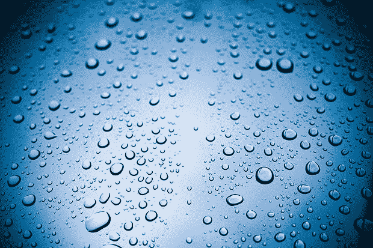

# 把石墨烯放在你的挡风玻璃上，跟你的雨刷说再见 TechCrunch

> 原文：<https://web.archive.org/web/https://techcrunch.com/2011/02/02/put-graphene-on-your-windshield-say-goodbye-to-your-windshield-wipers/>

# 把石墨烯放在你的挡风玻璃上，和你的雨刷说再见

  [弗利克](https://web.archive.org/web/20221209223645/http://www.flickr.com/photos/dearsomeone/4396028396/)

石墨烯，“纳米技术领域最热门的新材料之一”，刚刚让你汽车的雨刷[过时](https://web.archive.org/web/20221209223645/http://www.graphene-info.com/graphene-can-be-made-repel-water-very-effectively)。范德比尔特大学的研究人员已经设计出一种方法来改变石墨烯，使其附着在光滑的表面，如船体和挡风玻璃上。鉴于石墨烯可以毫不费力地排斥水，你刚刚创造了一种简单的方法来为你的挡风玻璃防雨。相当方便。

“石墨烯，嗯？”是的，这是一种新材料，它是由“一排排排列成环状的碳原子”组成的。我想我不需要提醒你碳无处不在，所以制造碳并不昂贵。

同样令人兴奋的是，材料是“10 倍”(！)比钢还要坚固，而且在室温下导电相当得心应手。

听起来像漫画超材料。“石墨烯——世界所有问题的解决方案！”

现在看看挡风玻璃刮水器游说团体试图禁止这种物质。