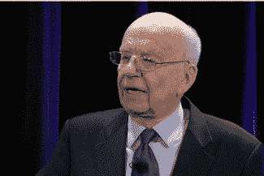
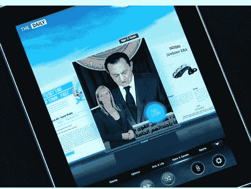
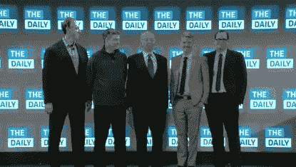
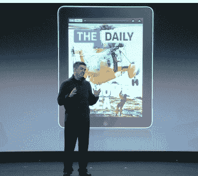

# 鲁珀特·默多克:“新时代，要求新新闻”

> 原文：<https://web.archive.org/web/https://techcrunch.com/2011/02/02/rupert-murdoch-new-times-demand-new-journalism/>

# 鲁珀特·默多克:“新时代，需要新新闻”

今天，鲁珀特·默多克[推出了](https://web.archive.org/web/20230203004857/https://techcrunch.com/2011/02/02/the-daily-event-liveblog-follow-along-as-the-newspaper-hits-the-information-age/)日报，这是他进军纯 iPad 报纸的一次尝试。“新时代需要新的新闻，”他说。他说，挑战在于“吸取传统新闻业的精华——竞争性的记者主义，怀疑的眼光，并将其与最好的技术相结合，如 360 度摄影。iPad 要求我们彻底反思我们的工艺。”

默多克指出，越来越多的新闻消费者不再阅读印刷品，甚至不再看电视。他创办《每日新闻》的目的是将“伟大报纸的魔力”与技术的魔力结合起来。日报并不是从印刷世界转移到数字世界的遗产。我们有实验许可证。我们相信,*日报*将成为讲述故事的典范。”

每天都会有新版本推出，全天都有更新。它将拥有一个看起来像 Coverflow 的旋转导航，一个包含视频和 360 度照片的功能。

由于没有卡车，也没有印刷成本，日报的价格是每天 14 美分，或者一周 1 美元。由于威瑞森的赞助，前两周是免费的。你可以在美国东部时间中午现场下载。

默多克还透露，启动和运行《每日新闻》的总成本——技术、员工、一切——已经达到 3000 万美元，运营成本为每周 50 万美元。

我问默多克，为什么他认为收费订阅比通过免费下载获得更多观众并卖给广告商更好，因为他们的广告在 iPad 应用程序中看起来更好。“我认为如果免费的话，他们将会少付很多钱，”默多克说。“我们认为这对广告客户更有利，能以更低的价格吸引更好的广告客户群体。”

**相关**:

[日常实践(演示视频)](https://web.archive.org/web/20230203004857/https://techcrunch.com/2011/02/02/daily-demo-video/)

[每日事件 Liveblog:跟随报纸进入信息时代](https://web.archive.org/web/20230203004857/https://techcrunch.com/2011/02/02/the-daily-event-liveblog-follow-along-as-the-newspaper-hits-the-information-age/)

[默多克:《每日邮报》的价格将是每天 0.14 美元或每周 0.99 美元](https://web.archive.org/web/20230203004857/https://techcrunch.com/2011/02/02/murdoch-the-daily-will-cost-0-14-per-day-or-1-per-week/)

[一键订阅来到 iPad](https://web.archive.org/web/20230203004857/https://techcrunch.com/2011/02/02/one-click-subscriptions-come-to-the-ipad/)

[日报是为谁办的？](https://web.archive.org/web/20230203004857/https://techcrunch.com/2011/02/02/who-is-the-daily-for/)

我们看到《每日邮报》安卓版的几率有多大？

