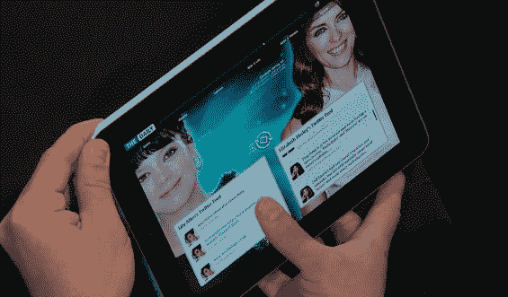

# 这份日报是给谁的？TechCrunch

> 原文：<https://web.archive.org/web/http://techcrunch.com/2011/02/02/who-is-the-daily-for/>

那么，既然《T2 日报》已经发行，它是为谁发行的呢？谁会阅读这个大胆的新闻新实验，为什么？

首先，让我声明，我们刚刚目睹了新闻业在线实践的巨大变化。默多克的雄厚财力推动了出版商两年来一直试图做的事情——为平板电脑用户创造一个引人注目的互动新闻来源。如果我可以这么大胆的话，我会把之前试图转移到 iPad 的流行科学和书籍的努力等同于 1.0，互联网前的光盘时代。内容是静态的，旧的方法——委托制作文本，小心地放在页面上，每月以高价发布——现在已经结束了。也就是说，我不敢打赌《每日邮报》会是这些新的“流媒体”报纸中最好或最受欢迎的，但我怀疑在最初几年它会是最受欢迎的。

首先，这份日报的特色是一发不可收拾的订阅。一旦最初的两周免费期结束，日报的粉丝将能够支付 40 美元购买由一个可以说是强大的记者团队发行的日报。《每日新闻》看起来就像是那种你下班后坐在沙发上看的报纸，而不是下班前在火车上看的，图片、设计和默多克关于故事“机智和幽默”的陈述都指向了博客世界而不是美联社风格指南激发的故事。

另一件有趣的事情是:你会注意到唯一真正的定制出现在体育版。新闻集团的私人禁猎区是华尔街，一旦你说服订阅《华尔街日报》的数百万胸闷的人也订阅《华尔街日报》，你就有了相当大的收入基础。再加上互动功能，你几乎就找到了早期采用者/富人的最佳点。

我不知道美国人会在哪里看日报。我们不会在火车上看，这是肯定的。因此，假设这是一个“一天结束”的阅读，或者，如果你在工作，一杯咖啡和一打甜甜圈的罪恶快感。

新闻集团知道如何销售新闻。不管你是否同意他们的一些频道和渠道，他们每天都提供非常受欢迎的内容。虽然我担心他们会把日报卖给谁，但我相信在 iPad 上用 Safari 阅读《纽约时报》和其他新闻来源的用户群会欢迎转向独立应用。如果内容质量保持在较高水平，并且有新闻价值，这可能是第一款击败《愤怒的小鸟》的 iPad 应用，更重要的是，它真正将新闻业带入了 21 世纪。

**相关**:

[每日动手操作(演示视频)](https://web.archive.org/web/20230203000548/https://techcrunch.com/2011/02/02/daily-demo-video/)

[每日事件 Liveblog:跟随报纸进入信息时代](https://web.archive.org/web/20230203000548/https://techcrunch.com/2011/02/02/the-daily-event-liveblog-follow-along-as-the-newspaper-hits-the-information-age/)

[默多克:《每日新闻》的价格将是每天 0.14 美元或每周 0.99 美元](https://web.archive.org/web/20230203000548/https://techcrunch.com/2011/02/02/murdoch-the-daily-will-cost-0-14-per-day-or-1-per-week/)

[一键订阅 iPad](https://web.archive.org/web/20230203000548/https://techcrunch.com/2011/02/02/one-click-subscriptions-come-to-the-ipad/)

我们会看到《每日邮报》的安卓版的几率有多大？

[鲁珀特·默多克:“新时代需要新新闻”](https://web.archive.org/web/20230203000548/https://techcrunch.com/2011/02/02/rupert-murdoch-new-times-demand-new-journalism/)