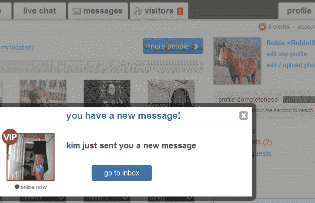
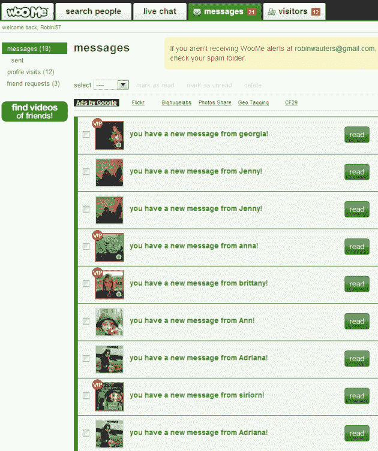
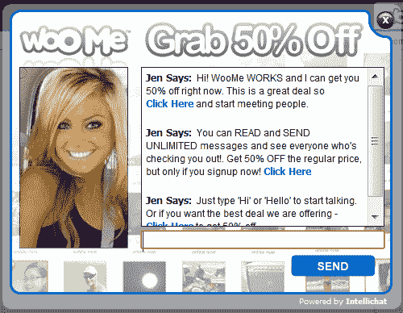

# WooMe: TechCrunch40 强入围者，2000 万美元的资金——一个巨大的骗局

> 原文：<https://web.archive.org/web/http://techcrunch.com/2011/02/02/woome-techcrunch40-finalist-20-million-in-funding-and-one-huge-scam/>

一个朋友刚刚说我应该用一匹马的照片而不是我自己的英俊面孔来报名参加 [WooMe](https://web.archive.org/web/20230203004346/http://www.woome.com/) ，看看接下来会发生什么。哇哦。

我知道在线约会行业有很多激烈的竞争，但我很少看到像 WooMe 这样策略激进的网站，我应该指出的是，WooMe 是 2007 年进入 TechCrunch40 决赛的(尽管其定位与今天略有不同)。

自从我注册了这个网站，再次以一匹马作为我的照片，在美国的午夜，我已经收到了大量不请自来的电子邮件、直接信息、弹出窗口、实时聊天会话，以及所谓的辣妹访问我明显伪造的个人资料。

我 15 分钟前才注册的。

现在，我需要做的就是注册成为 VIP WooMe 会员(每月 24.99 美元)，以查看谁访问了我的个人资料或给我发了这些私人信息。

好吧，这可能是一笔不小的数目，但我真的很想认识所有这些试图在半夜和一匹马(当然，很漂亮)约会的美国美女。另外，根据 WooMe 的说法，我将获得 1000 万会员的特权。是的，但是没有。

很明显，WooMe 的目标是那些在几分钟内注册该网站并收到来自女性(据我所知是 WooMe 的员工)的自动信息的人。你在这个网站上做的每一件事都指向付费页面，公司试图引诱你以每月 9.99 美元的价格注册(如果你注册 6 个月，并预付全部费用)。这是经典的诱饵和开关，从可怕的那种。

我从来没有使用过在线约会网站，所以也许它们都采用了这种咄咄逼人的策略，但 WooMe 运气不好，我的朋友认为我应该看看 TechCrunch40 决赛选手的表现。我的建议是:远离这个网站。

尽管这家公司可能不为人知，但它已经吸引了许多知名投资者，他们已经向该公司注入了大约 2000 万美元。让我们来看看:欧洲最优秀的三家风险投资公司， [Index Ventures](https://web.archive.org/web/20230203004346/http://www.crunchbase.com/financial-organization/index-ventures) 、[红树林资本合伙人](https://web.archive.org/web/20230203004346/http://www.crunchbase.com/financial-organization/mangrove-capital-partners)和 [Atomico Ventures](https://web.archive.org/web/20230203004346/http://www.crunchbase.com/financial-organization/atomico-investments) 都支持这家公司，还有领先的天使投资人 [Klaus Hommels](https://web.archive.org/web/20230203004346/http://www.crunchbase.com/person/klaus-hommels) 和 [Oliver Jung](https://web.archive.org/web/20230203004346/http://www.crunchbase.com/person/oliver-jung) 。

此外，还有经验丰富的管理团队[和](https://web.archive.org/web/20230203004346/http://www.woome.com/woome/team/)，其中包括首席执行官斯蒂芬·斯托科尔(之前是英国电信战略和业务发展的 SVP)和营销副总裁史蒂文·塞萨尔(之前负责 Shopzilla 的业务发展)。

所有人都应该为这样的特技感到羞耻。

**更新:** Stokols 与我取得联系，澄清一些事情。他说我做出了不准确的指控，WooMe 没有发送来自“虚假”用户的信息。因此，我想向乔治亚、珍妮、安娜、珍、布兰妮、安、西里安、阿德里亚娜、莎拉、安吉、布里、埃里卡、拉娜、奥利、米歇尔、奥图、梦想、奇迹、凯瑟琳和伊丽莎白(我不骗你)道歉，因为她们声称自己不是真正的女人，只是在等待新的马出现在网站上。

说真的，Stokols 告诉我，新用户出现在 people 页面结果的顶部，这就是为什么他们刚刚注册后就获得了不成比例的关注。对他来说，唯一的问题是我说的是秒，而不是我注册后的分钟。当我注册的时候，有一条信息在等我，我必须付费才能阅读。不可能有人这么快就联系到我，即使我不是一匹漂亮的马。

**更新 2** (来自[黑客新闻](https://web.archive.org/web/20230203004346/http://news.ycombinator.com/item?id=2169904)评论区):

【YouTube = http://www . YouTube . com/watch？v=MOtBmqqKVcc&w=480&h=390]

