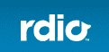
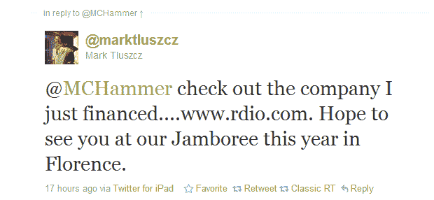

# 独家报道:社交音乐初创公司 Rdio 融资 1750 万美元，Rob Cavallo 加入 TechCrunch 董事会

> 原文：<https://web.archive.org/web/http://techcrunch.com/2011/02/03/exclusive-social-music-startup-rdio-raises-17-5-million-adds-rob-cavallo-to-board/?utm_source=feedburner&utm_medium=feed&utm_campaign=Feed%3A+Techcrunch+(TechCrunch>&utm_content=Google+Feedfetcher)

# 独家报道:社交音乐初创公司 Rdio 融资 1750 万美元，董事会增加了罗布·卡瓦洛

由 Skype 创始人[贾纳斯·弗里斯](https://web.archive.org/web/20230203003126/http://www.crunchbase.com/person/janus-friis)和[尼可拉斯·曾斯特罗姆](https://web.archive.org/web/20230203003126/http://www.crunchbase.com/person/niklas-zennstrom)创立的社交音乐初创公司 Rdio 并没有坐等 [Spotify](https://web.archive.org/web/20230203003126/http://www.crunchbase.com/company/spotify) 进军美国(或[谷歌音乐](https://web.archive.org/web/20230203003126/https://techcrunch.com/2010/09/03/google-music-launch/))。

TechCrunch 获悉，该公司已经从新投资者[红树林资本合伙人](https://web.archive.org/web/20230203003126/http://www.crunchbase.com/financial-organization/mangrove-capital-partners)以及早期投资者 [Skype](https://web.archive.org/web/20230203003126/http://www.crunchbase.com/company/skype) 、 [Atomico Ventures](https://web.archive.org/web/20230203003126/http://www.crunchbase.com/financial-organization/atomico-investments) 和 Friis 本人通过他的一些投资实体获得了[1750 万美元](https://web.archive.org/web/20230203003126/http://www.crunchbase.com/company/rdio)的资金。

具有讽刺意味的是，除了红树资本合伙公司(Mangrove Capital Partners)之外，Friis 共同创立了 Rdio 以及目前名单上的大多数投资者，红树资本合伙公司在 Skype 早期确实以支持 Skype 而闻名，并在该公司最终被出售给易贝时赚了一大笔钱。

Rdio 还获得了一名新的董事会成员，而且不是任何人；该公司已经任命华纳兄弟唱片公司董事长[罗布·卡瓦洛](https://web.archive.org/web/20230203003126/http://en.wikipedia.org/wiki/Rob_Cavallo)为新董事。卡瓦洛是格莱美提名的制作人，因与绿日、戴夫·马修斯乐队、佛利伍麦克乐队、朱厄尔、基德洛克和阿兰妮斯·莫利塞特等艺术家合作而闻名。

他加入 Rdio 董事会是为了进一步加强 Rdio 与音乐行业的关系，这是竞争对手 Spotify 甚至谷歌一直在努力解决的问题，特别是在美国。Rdio 已经与百代音乐、索尼音乐娱乐、环球音乐集团和华纳音乐集团建立了关系，并与数千家独立唱片公司达成了协议。

无限制点播社交音乐服务 ( [比如我自己](https://web.archive.org/web/20230203003126/https://techcrunch.com/2011/01/06/rdio-sonos/))的用户目前可以从超过 800 万首歌曲的目录中建立和分享在线音乐收藏。

Rdio 提供网络音乐流媒体服务，价格为 4.99 美元，以及每月 9.99 美元的高级版本，增加了[移动接入](https://web.archive.org/web/20230203003126/http://www.rdio.com/#/apps/mobile/)。

Rdio 将在今年使用额外的资金扩展到新的平台和新的地区。部分资金还将用于雇佣新员工、加大营销力度和产品开发。

有趣的是:关于红树林投资 Rdio [的消息上周泄露](https://web.archive.org/web/20230203003126/http://blog.quintura.com/2011/01/28/social-music-service-rdio-funded-by-mangrove-capital/)，尽管没有这轮投资的规模或任何其他细节，当时红树林合伙人 [Mark Tluszcz](https://web.archive.org/web/20230203003126/http://www.crunchbase.com/person/mark-tluszcz-2) 在他们参与的任何公开声明之前向 MC Hammer 发送了一条[推特。多。](https://web.archive.org/web/20230203003126/http://twitter.com/#!/marktluszcz/status/30729862306074624)

