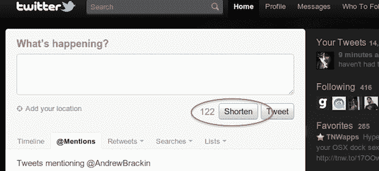

# Twitter 没有测试网址缩短按钮(但他们有一些扩展)

> 原文：<https://web.archive.org/web/http://techcrunch.com/2011/02/03/twitter-shorten-button/>

# Twitter 没有测试网址缩短按钮(但他们有一些扩展)

**更新**:尽管许多人在推特上谈论它，但这似乎不是一个官方的推特按钮。我们怎么知道？推特工程师达斯汀·迪亚兹在我们的评论中回应道:

> 这必须是某种扩展(也许有点？我们不知道)–这在我们的代码源中找不到。

我们已经正式联系了 Twitter，但是还没有得到回复。但我觉得没有理由不支持迪亚兹。所以，抱歉让大家都兴奋了！似乎是多个用户安装的某个扩展导致了这个按钮的出现——我们仍在努力找出是哪个扩展。

**以前**:尽管 Twitter 网站现在很棒，但对许多使用它的人来说，有一个很大的突出问题:链接缩短。令人难以置信的是，Twitter.com 没有提供自动或手动缩短链接的方法。你必须自己做，然后粘贴这些缩短的链接。好消息是，看来这种情况终于要改变了。

正如网站 [Gizable 第一次发现](https://web.archive.org/web/20230203001719/http://gizable.com/news/2011/02/04/twitter-adds-then-removes-the-shorten-button/)一样，Twitter 今天短暂测试了网站上标准“Tweet”按钮旁边的“Shorten”按钮。其他几个 Twitter 用户报告说在它消失之前也看到了这个按钮。而 Gizable 的 [@AndrewBrackin](https://web.archive.org/web/20230203001719/http://twitter.com/#!/@andrewbrackin) 甚至抢到了上面的截图。

另一个用户[注意到](https://web.archive.org/web/20230203001719/http://twitter.com/#!/jackstow/status/33270912627249152)使用的是 Bit.ly，而不是他们在其他客户端上使用的 Twitter 自己的 t.co 地址。

**更新 2** :啊哈！[有点儿](https://web.archive.org/web/20230203001719/http://twitter.com/#!/bitly/status/33389757895544832)。他们的 Chrome 扩展将此作为一个选项。

*【感谢基督徒】*