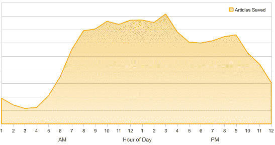
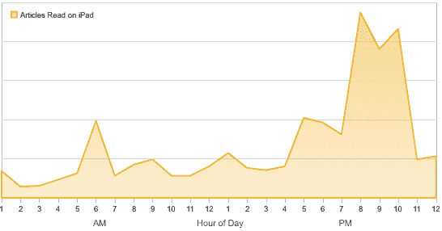
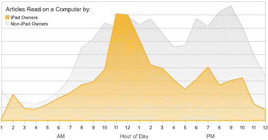
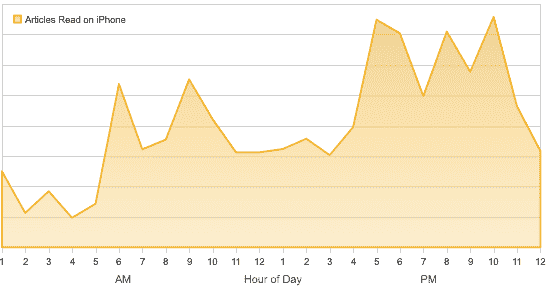

# iPad 如何改变在线阅读 TechCrunch

> 原文：<https://web.archive.org/web/http://techcrunch.com/2011/02/04/ipad-shifts-reading/>

# iPad 如何改变在线阅读的时间

像 [Read It Later](https://web.archive.org/web/20230203014831/http://readitlaterlist.com/) 和 [Instapaper](https://web.archive.org/web/20230203014831/http://www.instapaper.com/) 这样的书签应用变得如此受欢迎的原因之一是因为我们整天被新闻和有趣的链接淹没，但没有时间阅读它们。但是就像 DVR 帮助我们改变看电视的方式以更好地适应我们自己的时间表一样，这些应用程序帮助我们改变在线阅读的时间。根据本月早些时候 Read It Later 发布的一些数据，iPad 似乎正在成为时移阅读设备的首选。

Read It Later 为电脑、手机和 iPads 提供书签应用。它查看了用户保存的 1 亿篇文章。上图显示了一天中不同时间的节约活动量。在醒着的时候，这是相当一致的，正如你从不断被新信息轰炸的人们那里所期待的那样。它永远不会停止。下面是一个图表，显示了 iPad 用户实际上什么时候结束阅读他们保存的内容。正如你所看到的，预留给阅读的时间一直向右移动，晚上 7 点到 11 点是最佳时间。这表明 iPad 的使用正在与黄金时段的电视争夺人们的注意力(或者他们手拿 iPad 看电视，或者将他们的电视观看转移到其他时间)。

那些最终阅读他们保存在电脑上的文章的人，不会将他们的阅读时间向右移动太多。他们倾向于一有时间就整天阅读，这对整天坐在电脑前的人来说很有意义。他们一有空就阅读保存的资料。下图显示了 iPad 用户在电脑上阅读的文章与非 iPad 用户的文章的叠加，背景为灰色。iPad 用户也在电脑上阅读他们保存的文章，但大多是在中午。随着停机时间的增加，他们转向了 iPads。

如果你看看用户在他们的 iPhones 上阅读保存的文章的时间，图表在通勤、清晨和深夜更加尖锐。iPhone 是一个间隙阅读设备，填补了活动之间的时刻。

(向[约翰·博思威克](https://web.archive.org/web/20230203014831/http://twitter.com/#!/Borthwick/status/33586763435872258)致敬)。

