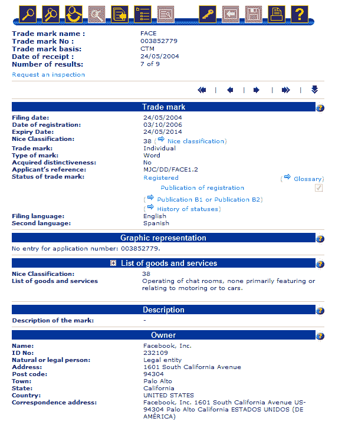
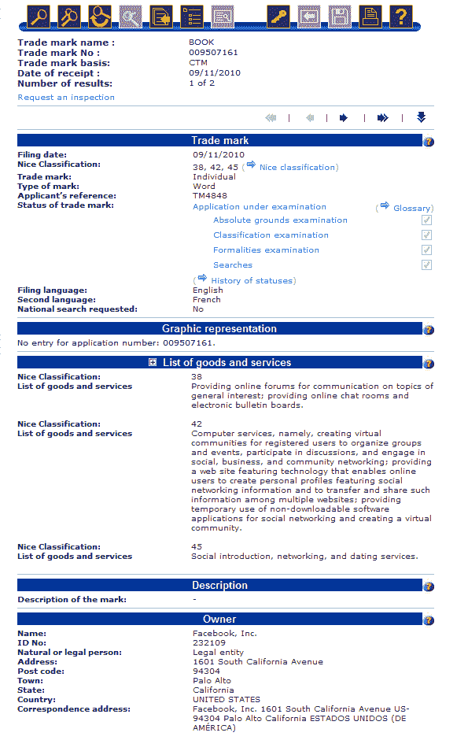

# 脸书已经在欧洲注册了“脸”的商标——下一个是“书”吗？TechCrunch

> 原文：<https://web.archive.org/web/http://techcrunch.com/2011/02/06/facebook-trademark-book-face-europe-eu/?utm_source=feedburner&utm_medium=feed&utm_campaign=Feed%3A+Techcrunch+(TechCrunch>)

# 脸书已经在欧洲注册了“脸”的商标——下一个是“书”吗？

我知道[脸书](https://web.archive.org/web/20230203001430/http://www.crunchbase.com/company/facebook)是[接近商标](https://web.archive.org/web/20230203001430/https://techcrunch.com/2010/11/23/patent-office-agrees-to-facebooks-face-trademark/)的术语[‘脸’](https://web.archive.org/web/20230203001430/https://techcrunch.com/2010/08/26/trademark-face/)，至少在美国与在线社交网络和相关活动有关。但据我所知，还没有人指出脸书已经在欧盟，即由 27 个欧洲成员国组成的联盟(包括英、德、法、西)中表演了这一特技。

在线约会行业的权威马克·布鲁克斯，好心地给我看了这份文件(下面的截图)，令人惊讶的是，这份文件可以追溯到 2004 年 5 月，当时脸书还处于发展初期。从截图中可以看出，EU-商标(我们应该指出的是，与在线聊天室运作中该词的使用有关)于 2006 年 10 月被授予，截止日期为 2014 年 5 月 24 日。

再说一次，我不完全确定这还没有被报道过，但是在一些调查之后我找不到任何关于它的报道，所以我想我应该在这里报道它，如果只是为了后代的缘故。

不过，事情变得更有趣了。

像在美国一样，脸书也在欧盟为“书”这个词申请商标，尤其是与在线社区、社交网络和网络约会服务相关的商标。这份文件是在 2010 年 11 月初提交的。

该申请仍在接受欧盟内部市场商标和外观设计注册处 OHIM 的审查。显然，我们会密切关注此事。

显然，这一举动可能会引发对该公司动机的进一步质疑。

TechCrunch 的读者将会意识到，这家社交网络巨头已经对在网站名称中使用“图书”一词的网站发起了战争(参见 [Lamebook](https://web.archive.org/web/20230203001430/https://techcrunch.com/2010/11/15/facebook-vs-lamebook/) 和 [Teachbook](https://web.archive.org/web/20230203001430/https://techcrunch.com/2010/08/10/facebook-placebook/) 案例)。脸书也将旅游网站 PlaceBook 推至[，并将其名称](https://web.archive.org/web/20230203001430/https://techcrunch.com/2010/08/10/facebook-placebook/)改为 TripTrace。

我已经问了脸书的意见，当我得到回复时会更新。

