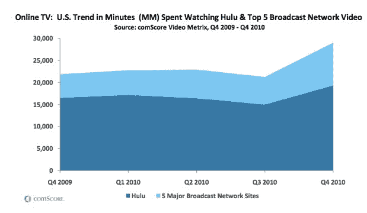

# ComScore: Hulu 的收视率是 5 大在线电视网总和的两倍 TechCrunch

> 原文：<https://web.archive.org/web/https://techcrunch.com/2011/02/07/comscore-hulu-tv-networks/>

# ComScore: Hulu 的观看人数是 5 大在线电视网总和的两倍

在 2010 年一份关于数字趋势的新报告中

说到网络上的优质视频，Hulu 仍然占据统治地位。在第四季度，美国在线观众在 Hulu 上观看了 194 亿分钟视频，是五大电视网网站观众观看量总和的两倍。观众在 ABC、CBS、NBC、Fox 和 CW 的网站上观看了另外 97 亿分钟的在线视频。上面的图表来自 comScore 的[报告](https://web.archive.org/web/20230203015540/http://www.comscore.com/Press_Events/Presentations_Whitepapers/2011/2010_US_Digital_Year_in_Review)。

虽然 Hulu 仍占主导地位，但个人网站的增长速度更快。就在线观看视频的时间而言，他们增长了 82%，相比之下，Hulu 增长了 17%。加在一起，Hulu 和五大网络的观看分钟数增长了 33%。

Hulu 与电视网络有着爱恨交加的关系。他们意识到 Hulu 是一个比他们个人网站更好的分销渠道(人们希望在一个地方找到他们所有的节目)，但他们也不想把他们的观众让给 Hulu。这种紧张关系导致 Hulu 不断与网络进行谈判，并试图转向订阅模式，至少在 iPad 这样的新平台上。

但是如上图所示，Hulu 不会很快被取代。也许这就是为什么维亚康姆最近[带回了](https://web.archive.org/web/20230203015540/https://techcrunch.com/2011/02/02/the-daily-show-and-colbert-report-return-to-hulu-via-new-viacom-content-partnership/) *科尔伯特*和*每日秀*