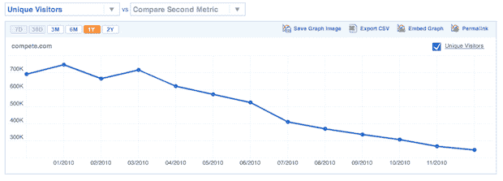
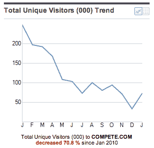

# 据 Compete TechCrunch 报道，Compete 一落千丈

> 原文：<https://web.archive.org/web/http://techcrunch.com/2011/02/09/compete-on-compete/?utm_source=feedburner&utm_medium=feed&utm_campaign=Feed%3A+Techcrunch+(TechCrunch>)

# 据 Compete 报道，Compete 一蹶不振

当谈到面向公众的网络分析时，基本上，它们都很糟糕。我们媒体有时被迫使用像 [Alexa](https://web.archive.org/web/20230203000224/http://alexa.com/) 和 [Compete](https://web.archive.org/web/20230203000224/http://compete.com/) 这样的工具进行比较，但是使用其中任何一个来表示绝对数字都是有极大缺陷的，基本上是没有价值的。自然，我们说这样的话，那些公司总是不同意。但是一项新的信息可能会对这一分歧进行检验。

Compete.com 的[参赛图很完美。如果图表可信的话，竞争完全失控了。根据他们的数据，他们已经从 2010 年 1 月的大约 75 万独立访问者下降到 2010 年 12 月的大约 25 万。总访问量的数字甚至更糟(从 325 万下降到大约 75 万)。自 3 月份以来，两者都在逐月下降。两者都没有停止的迹象。](https://web.archive.org/web/20230203000224/http://siteanalytics.compete.com/compete.com/)

据我所知，这些数字是正确的。但我所能做的就是比赛告诉我的。一些事情告诉我，完整的他们自己将会争论他们，就像当你在一篇博客文章中使用完整的数字时，这个星球上的每一个其他的网站所做的一样。

值得一提的是，Alexa 似乎没有足够的数据来给自己排名。多方便啊。或者悲伤。

**更新**:这是来自 [comScore](https://web.archive.org/web/20230203000224/http://www.comscore.com/) (一个更可靠的服务)的数字，显示美国的数字也有类似的下降(如下)。但是正如你所看到的，绝对数字相差甚远。

*【谢谢大卫】*