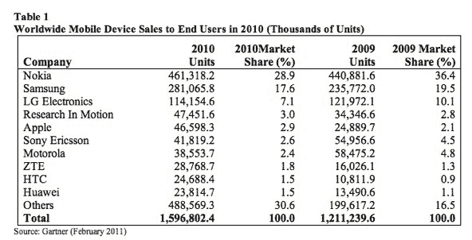
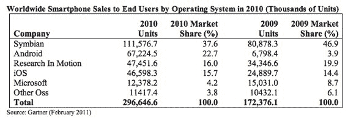

# Gartner:2010 年 Android 操作系统销量超过 iOS 和 RIM，增长 888%

> 原文：<https://web.archive.org/web/https://techcrunch.com/2011/02/09/gartner-android-os-sales-trumps-ios-and-rim-grew-888-percent-in-2010/>

# Gartner:2010 年，Android 操作系统的销量超过了 iOS 和 RIM，增长了 888%

Gartner 刚刚[发布了一份关于 2010 年移动设备销售的报告](https://web.archive.org/web/20230326191039/http://www.gartner.com/DisplayDocument?ref=clientFriendlyUrl&id=1542114)，不出所料，面向终端用户的智能手机销售额比 2009 年增长了 72.1%，占 2010 年移动通信设备总销售额的 19%。就第四季度而言，智能手机占该季度 4.52 亿部移动设备销售额的 22.2%。2010 年，全球终端用户的移动设备销售总量为 16 亿台，比 2009 年增长了 31.8%。

智能手机销量的增长帮助苹果和 Research In Motion 在全球移动设备制造商中的排名分别上升至第五和第四位，取代了索尼爱立信和摩托罗拉。2010 年第四季度，西欧和北美占全球智能手机销量的 52.3%，智能手机占这些地区销售的所有手机的近一半。

苹果在 2010 年售出了 4660 万台，比 2009 年增长了 87.2%。Gartner 将这一增长归因于国际扩张和排他性交易的结束。受东南亚、英国和荷兰强劲销售的推动，RIM 2010 年向最终用户销售的手机总量达到 4750 万部，同比增长 38.2%。此外，RIM 的市场份额从 2009 年第四季度的 19.5%下降到 2010 年第四季度的 13.7%。

根据 Gartner 的报告，诺基亚在 2010 年也表现不佳。2010 年，诺基亚面向终端用户的年度手机销量达到 4.613 亿部，市场份额比 2009 年下降了 7.5%。诺基亚在智能手机市场的份额比 2009 年下降了 6.7 个百分点。

就智能手机操作系统的销量而言(相对于制造商而言)，Android 在 2010 年增长了 888.8%，排名第二，仅次于 Symbian，Symbian 的市场份额在 2010 年第四季度进一步下降至 32.6%，即 3260 万台。苹果的 iOS 在 2010 年占据了第四的位置，当年售出了 4650 万台。

