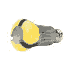

# LED 热:Bridgelux 增加 2100 万美元资金，数字流明走向全球| TechCrunch

> 原文：<https://web.archive.org/web/http://techcrunch.com/2011/02/09/led-mania-bridgelux-digital-lumens/>

尽管[保守派对](https://web.archive.org/web/20230331064838/http://blog.heritage.org/2010/09/23/the-government%E2%80%99s-light-bulb-ban-is-just-plain-destructive/)白宫让老旧的白炽灯泡技术(及其低能效)退役的举措心存疑虑，但发光二极管和高效照明系统的市场仍在继续增长。

在最近一连串的里程碑事件中:LED 芯片制造商 [Bridgelux](https://web.archive.org/web/20230331064838/http://bridgelux.com/) 获得了 2100 万美元的投资；并且[数字流明](https://web.archive.org/web/20230331064838/http://www.digitallumens.com/)获得了认证，这将有助于其向墨西哥和加拿大出口节能照明系统。

上周，奥巴马总统提出了“更好的建筑倡议”,以提高商业建筑的能源效率，使其在未来十年内在全国范围内提高 20%的能源效率。根据白宫发布的一份声明，该计划将“通过一系列激励措施来促进私营部门的投资，以升级美国各地的办公室、商店、学校和其他市政建筑、大学、医院和其他商业建筑”。

去年(2010 年)，美国国内的商业建筑消耗了美国经济中大约 20%的能源。2009 年，根据美国能源信息署的最新估计，商业和住宅照明用电量约占美国总用电量的 13.6%。

同时[家得宝](https://web.archive.org/web/20230331064838/http://news.cnet.com/8301-11128_3-20022991-54.html?part=rss&subj=news&tag=2547-1_3-0-20)和其他零售商已经开始销售从 [Cree](https://web.archive.org/web/20230331064838/http://cree.com/) 到 [Philips](https://web.archive.org/web/20230331064838/http://www.usa.philips.com/) (上图)生产的 LED 灯泡，这种灯泡可以用在与白炽灯相同的灯具中，有时比“猪尾巴”品种、能源之星认证的 CFL 灯泡更节能。

位于加州利弗莫尔的 Bridgelux 在国内生产发光二极管芯片和阵列。其最新的 2100 万美元可转换票据投资在今天的一份 [SEC 文件中公开。](https://web.archive.org/web/20230331064838/http://sec.gov/Archives/edgar/data/1380328/000138032811000001/xslFormDX01/primary_doc.xml)

该公司的风险投资者包括:VantagePoint、DCM、El Dorado Ventures、VentureTech Alliance、Chrysalix Energy Venture Capital 和 Harris & Harris Group，以及未披露身份的投资者。在最近一轮融资之前，该公司筹集了 1.135 亿美元，Emma Ritch 在 1 月份为[清洁技术集团](https://web.archive.org/web/20230331064838/http://cleantech.com/news/5487/bridgelux-ceo-series-d-80m-watkins)报道。Bridgelux 没有立即回应有关其计划将新增资本用于何处的详细请求。

波士顿的 Digital Lumens (DL)今天透露，其智能光引擎——用于发光二极管的智能灯具——获得了新的安全认证，允许该硬件在墨西哥和加拿大广泛销售。

它的硬件现在带有墨西哥和加拿大相当于美国保险商实验室或 UL 上市公司的名称(NOM)和 ULC(Underwriters Laboratory Canada)标志。为了达到这些要求，产品必须符合独立实验室的安全和性能标准。

根据 Digital Lumens 的网站，这些灯具形成了“一个无线网状网络，可以收集详细的能源消耗和建筑占用细节”，并帮助建筑经理和工程师控制和减少与照明相关的能源成本和消耗。

自从公司在 2008 年从 Groom Energy 剥离出来，Digital Lumens 已经获得了来自 Black Coral Capital、Flybridge Partners 和 Stata 的风险投资。它还从 A123 Systems 和 ColorKinetics 吸引了顶尖的清洁技术人才。

纵观高效照明市场，整体而言 [Groom Energy 和 Greentech Media Research](https://web.archive.org/web/20230331064838/http://www.greentechmedia.com/articles/read/report-led-lights-in-the-enterprise-to-be-1b-by-2014/) 预测:

> “2011 年，LED 企业照明市场将增长 30%，到 2014 年，年收入将超过 10 亿美元……2010 年，美国商业和工业 LED 照明市场约为 3.3 亿美元。”