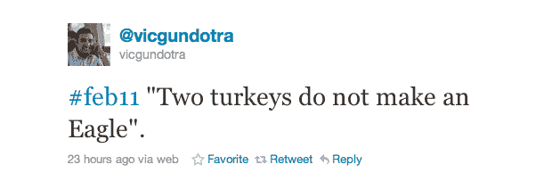

# 维克·冈多特拉揭露诺基亚、抨击微软的推文 TechCrunch 的许多精彩层面

> 原文：<https://web.archive.org/web/http://techcrunch.com/2011/02/09/nokia-microsoft/>

你必须热爱推特，你必须热爱维克·冈多特拉和 T2。

今天早上，谷歌副总裁决定在 Twitter 上找点乐子。” *#feb11“两只火鸡不成一只鹰”。*，[他发微博](https://web.archive.org/web/20230202235926/http://twitter.com/#!/vicgundotra/status/35182523650801664)。对于技术领域之外的任何人来说，这听起来像是胡言乱语。见鬼，即使对许多科技领域的人来说，这似乎也是一件完全随意的事情。只不过这不是随机的。这是冷静和计算。

冈多特拉提到的 2 月 11 日显然是指诺基亚一年一度的资本市场日，即本周五，即 11 日，在伦敦举行。在那里，新任首席执行官(前微软总裁)史蒂芬·埃洛普预计将宣布公司计划和愿景的彻底改变。几周来，有传言称，诺基亚可能会与微软或谷歌结盟，推进智能手机业务。冈多拉今天早上的推特说得很清楚，诺基亚会和谁一起去。其他人。

多酷啊。谷歌的一个非常著名的傀儡领袖刚刚向微软和诺基亚投下了一枚推特炸弹，巧妙地提前曝光了他们的新闻。他通过公然侮辱两家公司做到了这一点。哦，对了，他以前在微软工作过！整整 15 年！

冈多拉在推特上的俏皮话会不会只是在瞎猜？不会吧。冈多特拉，虽然现在[被认为将引领](https://web.archive.org/web/20230202235926/https://techcrunch.com/2010/08/04/war-patten-rommel-vic-gundotra-google-facebook/)谷歌正在[秘密](https://web.archive.org/web/20230202235926/https://techcrunch.com/2010/12/07/google-plus-one-pic/) [开发](https://web.archive.org/web/20230202235926/https://techcrunch.com/2010/12/02/google-plus-one-brin/)的社交产品，但也非常熟悉 Android。他一直在谷歌 I/O 的舞台上没完没了地宣传移动平台。他非常擅长这个，以至于他几乎可以把 Android 卖给一个 iPhone 用户。[差不多](https://web.archive.org/web/20230202235926/https://techcrunch.com/2010/12/31/nexus-s-iphone-review/)。

如果有像诺基亚和安卓谈判这样重大的事情发生，冈多拉会知道的。另一方面，他也知道诺基亚的人还在和谁通话。你可以肯定，他不会发任何微博，除非他知道一些事情，并且知道这是一个既定的交易。你可以非常肯定，他不会在推特上称任何人为“火鸡”，直到他确定这不是谷歌的方式。

《商业周刊》今晚[的一篇更加微妙的报道](https://web.archive.org/web/20230202235926/http://www.businessweek.com/news/2011-02-09/nokia-is-said-to-be-near-partnership-with-microsoft.html)证实，诺基亚将与微软合作，在他们的智能手机上安装 Windows Phone 7。这是我们本周早些时候首次报道的事情。在我们听说埃洛普亲切地离开雷德蒙德后，这是我们已经谈论了几个月的事情。写在墙上。

也就是说，谷歌确实尝试过这种合作关系。我们知道，几个月前，当诺基亚 MeeGo 集团陷入混乱时，埃洛普曾与谷歌首席执行官埃里克·施密特交谈。最近几个月，你可以打赌，随着埃洛普考虑什么对他的新公司最有利，双方的讨论加剧了。但是，使用 Android 虽然可能是明智的，但却相当于埃洛普打了微软 CEO 史蒂夫·鲍尔默一拳。这是不可能的。

取而代之的是，仍然拥有绝对大规模移动覆盖面的公司(诺基亚)将与拥有无尽口袋的公司(微软)合作，后者实际上已经成功开发了一个相当不错的移动操作系统。问题是，它的出现至少晚了一年，或许也晚了两年。诺基亚的合作伙伴正是微软需要的，以便有机会重返游戏。这也是诺基亚以有意义的方式进入智能手机市场(甚至可能是美国市场)所需要的。

这就是为什么冈多拉的推文虽然很棒，但可能是不明智的。两只火鸡可能无法组成一只鹰，但对于一些渴望智能手机的新客户来说，它们可能看起来非常美味。这笔交易有些道理。

但是等等，这条推文实际上更深入。这实际上更像是一场智力游戏。

正如 [Engadget 所指出的](https://web.archive.org/web/20230202235926/http://www.engadget.com/2011/02/09/googles-vic-gundotra-on-nokia-two-turkeys-do-not-make-an-eagl/),“两只火鸡造不出一只鹰”这句话背后有相当的历史具体来说，前诺基亚副总裁 Anssi Vanjoki [在 2005 年](https://web.archive.org/web/20230202235926/http://www.digitimes.com/news/a20050615A6027.html)提到竞争对手明基收购西门子手机业务时说的。你可能还记得，今年早些时候，Vanjoki 将使用 Android 设备的人比作在寒冷的冬天尿在裤子里取暖的芬兰男孩。[是的，他真的这么说了](https://web.archive.org/web/20230202235926/https://techcrunch.com/2010/09/23/android-nokia-pee-pants/)。我们知道谷歌不太喜欢这样。

所以没错，这么短的推文，有很多层。一层恶意，一层勾心斗角，一层幽默，一层讽刺，至少四层牛逼。

*【图片:Flickr/[pen waggener](https://web.archive.org/web/20230202235926/http://www.flickr.com/photos/epw/348448681/)】*