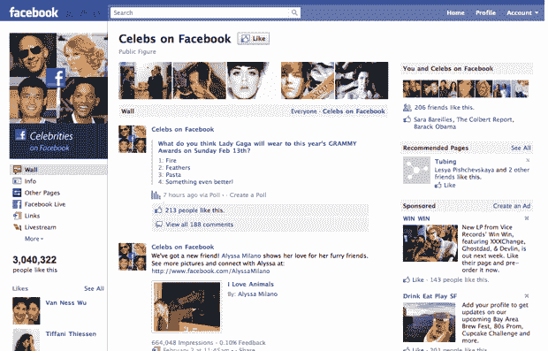

# 脸书统一用户界面，为“页面”TechCrunch 推出新设计

> 原文：<https://web.archive.org/web/http://techcrunch.com/2011/02/10/facebook-unifies-ui-as-it-rolls-out-new-design-for-pages/>

回到 12 月，脸书[发布了](https://web.archive.org/web/20230202235823/https://techcrunch.com/2010/12/05/new-facebook-profile/)对用户资料的重大重新设计，现在在页面顶部有一些照片，新的部分展示你的家庭成员和最好的朋友，以及一些其他主要是化妆品的调整。如今，该网站推出了类似的“脸书页面”设计——品牌、企业和名人使用的公共档案，可以同时与成千上万的粉丝交流。

新的页面包含了 12 月重新设计时的许多变化:你现在可以在页面顶部显示图片。应用程序标签正从个人资料的顶部向下移动到个人资料图片下方的侧边栏。还有一个小部件可以显示你和这个页面有哪些共同的“喜欢”。这给我们带来了一些更有趣的变化。

脸书现在给网页提供了和普通用户一样的功能——你可以像浏览网页一样浏览脸书(这并不像听起来那么令人困惑)。例如，我可以控制 TechCrunch 页面，并在 Chipotle 的页面上留下评论，说我们非常喜欢他们的墨西哥卷饼，留下评论的用户名将是 TechCrunch。

页面也可以“喜欢”其他页面。因此，举例来说，我可以将 TechCrunch 页面导航到恩雅的官方粉丝页面，然后“喜欢”这些页面，也许我还会浏览谷歌和苹果，然后“喜欢”这些页面。每个页面的状态更新都会出现在我的新闻提要中(是的，页面现在也有了新闻提要)。

当你作为页面登录时，你的通知窗口会让你知道人们留下了评论，通常显示朋友请求的按钮现在会告诉你自从你上次登录以来收到了多少个赞。此外，作为对脸书所说的突出要求功能的回应，当人们与他们的页面交互时，管理员可以通过电子邮件接收更新。

页面本身的另一个有趣的变化是:在此之前，脸书并没有对其他用户留下的评论进行排序——它们只是按时间倒序显示。这导致了一大堆噪音，并使评论在流行的网页上几乎毫无用处。现在，脸书正在使用一种类似于 News Feed 的算法，根据谁留下的评论(如果你是在页面上留下评论的人的朋友，你会在顶部看到这个评论)，评论的参与度，以及评论是否是用你理解的语言留下的，来对这些评论进行分类。

脸书允许页面所有者在接下来的四周内预览新设计(你可以随时升级)。3 月 10 日，该变更将对所有人强制执行)。是的，新功能应该可以很好地适应位置页面——如果您将一个位置页面与一个普通页面合并，那么结果将包括修改后的设计和功能，以及位置选项卡(是的，最后一点令人困惑)。

其中一些变化非常显著，尤其是增加了页面与用户和其他页面的交互量。我想，随着品牌和名人开始回应彼此的帖子，我们将开始看到一些有趣的交流。

请注意，我们在 12 月份短暂地看到了[这些新功能](https://web.archive.org/web/20230202235823/https://techcrunch.com/2010/12/16/big-day-for-facebook-new-pages-memories-and-downtime/)，当时许多脸书功能因为一个小故障而上线。