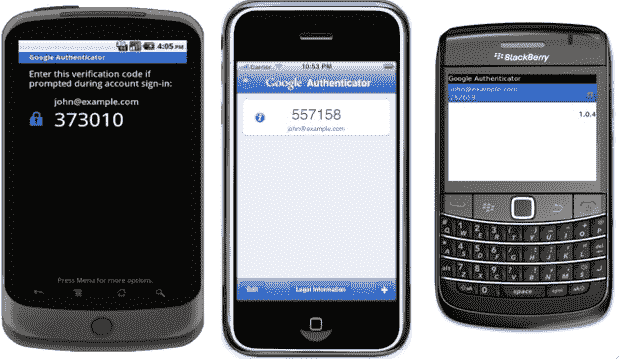

# 谷歌为每个人推出双重认证。你应该使用它。TechCrunch

> 原文：<https://web.archive.org/web/https://techcrunch.com/2011/02/10/google-rolls-out-two-factor-authentication-for-everyone-you-should-use-it/>

鉴于如今我们对在线网站的信任程度——电子邮件、搜索历史记录，甚至语音通话——我们的账户密码被钓鱼、黑客攻击或猜测的后果比以往任何时候都更严重。不幸的是，就消费者而言，账户安全多年来一直停滞不前:几乎每项服务都需要用户名和密码，仅此而已。播放可怕的音乐和关于你的身份被盗的特别报道。

但是今天，谷歌正在为那些想要的人做得更好。**更新:**谷歌实际上正在未来几天推出这一产品，所以你可能还看不到。

这项功能被称为双因素认证，自 9 月份起，谷歌应用套件的用户[就可以使用这项功能。现在向所有人推广。这有点令人困惑，设置过程可能会吓到很多人，但如果你重视你的帐户数据，这很值得一看。您可以点击](https://web.archive.org/web/20221206162605/https://beta.techcrunch.com/2010/09/20/google-secure-password/)[本页](https://web.archive.org/web/20221206162605/https://www.google.com/accounts/ManageAccount)上的“两步验证”链接来激活它。那么它到底是做什么的呢？

简而言之，当你登录你的谷歌账户时，你需要输入你现有的密码和一个特殊的新的*秒*密码——一个你不必写下来或记住的密码，因为它总是在变化，所以几乎不可能被钓鱼。你可以通过启动一个名为“谷歌认证器”(Google Authenticator)的新手机应用来生成第二个密码，或者让谷歌给你设置该功能时输入的电话号码打电话或发短信。密码将在几分钟后过期，所以要快(是的，你第一次使用它的时候会感觉像个特工)。

这并不像听起来那么紧张，因为您可以选择每台计算机只需要一次第二个密码(这仍然可以防止网络钓鱼者访问您的帐户)。它还有一些奇怪的地方——为了在 iCal、Mail 和大多数其他桌面应用程序中存储密码，您必须生成一个唯一的应用程序专用密码。但是，你可以保存它，这样每个应用程序只需保存一次。

如果你无法使用手机，也有一些备用措施。您可以指定第二个备用电话号码来接收密码，并且强烈建议您打印一组“一次性”密码，保存在安全的地方。这只适用于二级密码——你仍然需要记住那个“普通的”谷歌密码。

在过去的几周里，我一直在使用该系统的测试版，在很大程度上，我对它非常满意。设置过程，虽然自从我第一次使用它以来已经有所改进，但仍然相当复杂。你真的不需要做太多的思考，设置向导只需要几分钟就可以完成，但在使用旧系统十年(或更久)后，这整个第二密码的事情感觉很陌生。这可能是为什么谷歌还没有向消费者大力推广这项功能——你必须在你的账户仪表板中寻找它。

需要说明的是，双因素身份认证并不是一个新想法。它已经被大型企业使用了很多年。但是让消费者获得同样的保护是一个巨大的胜利，我希望其他服务在不久的将来也会效仿。
