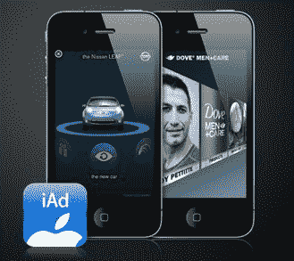

# 手机业内人士表示，苹果的 iAds 正在“伤害”TechCrunch

> 原文：<https://web.archive.org/web/https://techcrunch.com/2011/02/10/mobile-insiders-say-apples-iads-are-hurting/>

苹果的 iAds 正遭遇困境。总的来说，我采访过的几个开发人员证实，IAD 的“填充率”在新年后大幅下降，并且还没有恢复。两家独立开发商的广告填充率——实际上广告填充了广告库存的多少——从 18%骤降至 6%。在一些较新的应用程序中，没有一个广告位被填满，相比之下，其他移动广告网络的填充率几乎为零。其他人报告了更好的填充率，但正如一位开发商所说，“他们肯定已经下降了。”

下降的一个原因可能只是季节性的。节日过后，所有广告网络的填充率和广告预算都会受到冲击。但是这里似乎还有其他的事情。“广告界的普遍共识是，这是他们不想要的产品，”一位移动广告技术公司的首席执行官表示。他表示，iAds 业务“正在受到伤害。”

(为了撰写本文，我与许多 iPhone 应用程序开发人员和广告高管进行了交谈。他们所有人都只在背景下说话，因为公开激怒苹果并不被认为是一个伟大的职业举动。

当史蒂夫·乔布斯去年引入 iAds 时，他让苹果走上了重塑移动广告的道路。他希望手机广告不要太烂，所以苹果想出了一种新的格式和标准，并将其强加给整个行业。乔布斯不希望廉价的库存被填满，而是希望广告被视为品牌体验。苹果收取额外费用——要求每次活动的最低投入为 100 万美元。

乔布斯的目标不是移动广告预算，而是电视广告预算。他认为 iAds 可能比电视广告更好，因此这些预算应该花在他的移动广告上。苹果提升 iAds [对抗电视广告](https://web.archive.org/web/20221205124652/http://www.crunchgear.com/2011/02/03/nielsen-apple-iads-more-effective-than-tv-ads/)的表现，而不是对抗其他移动广告，这并非巧合。

史蒂夫·乔布斯可能是世界上最好的推销员。乔布斯和 iAd 总裁安迪·米勒亲自帮助说服广告商和首席执行官立即购买价值 6000 万美元的 iAd。一家大型 iPhone 应用公司的高管表示:“我倾向于认为，这是苹果的一次精彩推销，你让首席执行官们来做广告决策。”。这是“荣耀支出”，来自自由支配或公关预算(很少有公司有百万美元的移动广告预算)。“作为首席执行官，你只能做一次这样的决定，”这位高管说。

现在小鸡们要回家休息了。在销售了最初的广告活动后，这些关系被转交给苹果广告业务中的初级客户经理(来自苹果去年以 2 . 75 亿美元收购 Quattro Wireless 的)。他们今年的任务是从广告公司和品牌那里获得更新或者同等或更多的金额。但实验已经结束(广告商现在可以看到广告的表现)，这些初级销售人员无法接触到首席执行官。他们需要与广告公司和品牌的同行交谈，他们不可能这么容易地在移动广告活动上花费 100 万美元。一位广告公司的高管告诉我，iAd 的销售人员突然打电话的次数多了很多，并且非常积极地要求续约。

除了百万美元的承诺，广告公司的普通员工在 iAds 上还有其他问题。它们只在苹果设备上运行，[不像谷歌和其他公司的移动广告那样是跨平台的。即使在苹果平台上，也看不到它们在哪里运行。广告商购买了一个广告，苹果决定在所有运行 iAd inventory 的应用中把它们放在哪里。这种黑箱方法源于 Quattro 在收购前看到的问题，即所有的广告商都希望成为热门应用程序，这些应用程序很快售罄，而网络中的其他应用程序则陷入饥饿。](https://web.archive.org/web/20221205124652/https://beta.techcrunch.com/2010/10/23/in-the-fight-against-apples-iads-google-plays-the-cross-platform-card/)

另一个问题是定价。这让移动广告营销人员感到困惑，因为它是基于印象和表现的结合。每次显示广告都有一个最低 CPM(每千次展示的成本)，然后每次打开广告都有一个额外的成本(称为“扩展”)。许多人错误地点击了真正不感兴趣的广告，这意味着广告商为不想要的参与付费，在某些情况下将有效 CPM 推高至 50 美元或 60 美元(更典型的是，这只是其中的一小部分，但仍远高于大多数移动广告的低个位数 CPM)。

“你甚至无法想象 CPM 是什么——完全超出了图表，”一位在 2010 年末大赚 iAds 一笔的开发者说，现在他哀叹 iAds 正在枯竭。即使填充率很低，开发商的广告收入也是其他网络的五倍多。现在，苹果面临着重复这一表现的压力。

降低百万美元门槛可能是让 iAds 对移动营销人员更有吸引力、更易接近的一种方式。但乔布斯的目标不是移动广告预算。他正在瞄准电视广告预算。他认为 iAds 可能比电视广告更好，因此这些预算应该花在他的移动广告上。苹果公司吹捧互联网广告的表现是针对电视广告，而不是其他移动广告，这并非巧合。乔布斯会让广告业屈从于他的意志吗？现在，看起来抵抗开始了。