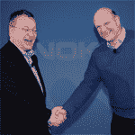

# 诺基亚确认微软合作伙伴关系、新领导团队、组织变革

> 原文：<https://web.archive.org/web/https://techcrunch.com/2011/02/10/nokia-confirms-microsoft-partnership-new-leadership-team/>

在伦敦的战略和财务简报会之前，[诺基亚](https://web.archive.org/web/20230304113037/http://www.crunchbase.com/company/nokia)已经[与](https://web.archive.org/web/20230304113037/http://www.nokia.com/press/press-releases/showpressrelease?newsid=1488004)分享了它计划在会上宣布的一些细节。不出所料，该公司正在调整其战略，与微软保持一致。

到目前为止，你可能已经看到了世界上最大的手机制造商的新任首席执行官、前微软高管[史蒂芬·埃洛普](https://web.archive.org/web/20230304113037/http://www.crunchbase.com/person/stephen-elop-2)撰写的“燃烧的平台”备忘录(这份极其诚实的备忘录首先由 [TechCrunch Europe](https://web.archive.org/web/20230304113037/http://eu.beta.techcrunch.com/2011/02/07/nokia-heading-to-silicon-valley-and-the-standing-on-a-burning-platform-memo/) 报道，随后由 [Engadget](https://web.archive.org/web/20230304113037/http://www.engadget.com/2011/02/08/nokia-ceo-stephen-elop-rallies-troops-in-brutally-honest-burnin/) 全文发布)。

在这篇文章中，埃洛普谈到了公司强大的竞争对手(苹果和谷歌的 Android 操作系统战略)，这些竞争对手一直在创新上超越诺基亚，并稳步占据其市场份额。很明显，埃洛普正准备宣布一些关于诺基亚未来战略的重大变化。他做到了。(下面是完整的新闻稿)

肉在这里:

> –与微软建立广泛战略合作伙伴关系的计划，以建立新的全球移动生态系统；Windows Phone 将成为诺基亚主要的智能手机平台。
> —一种捕捉销量和价值增长的新方法，将发展中增长市场的“下一个 10 亿人”与互联网连接起来
> —专注于下一代颠覆性技术的投资
> —一个新的领导团队和组织结构，明确关注速度、结果和责任

Windows Phone 将成为诺基亚主要的智能手机平台=巨大。据报道，微软向诺基亚提供了数亿美元来实现这一转变。

诺基亚将在其设备上使用必应搜索功能，而诺基亚地图将成为微软地图服务的核心。诺基亚的内容和应用商店将与微软的市场整合。更多合作信息请点击查看[。](https://web.archive.org/web/20230304113037/http://conversations.nokia.com/2011/02/11/open-letter-from-ceo-stephen-elop-nokia-and-ceo-steve-ballmer-microsoft/)

【YouTube = http://www . YouTube . com/watch？v=xe3ksR8zgXg&w=640&h=390]

诺基亚表示，Symbian 将成为一个“特许经营平台”，而 MeeGo 将成为一个开源的移动操作系统项目。用他们的话说:

> “MeeGo 将更加重视对下一代设备、平台和用户体验的长期市场探索”。

诺基亚仍计划在今年晚些时候推出一款与 MeeGo 相关的产品。

管理团队最大的变化是:阿尔贝托·托雷斯显然已经辞职，2 月 10 日生效，以“追求公司以外的其他利益”。Torres 于 2004 年加入诺基亚，是 MeeGo Computers，Mobile Solutions 的副总裁。

截至 4 月 1 日，诺基亚还将拥有一个新的公司结构，其中包括两个不同的业务部门:智能设备和移动电话。

你可以在下面的新闻稿中了解更多这意味着什么，毫无疑问，在接下来的几个小时和几天(甚至更久)里，这些新闻稿将被媒体和分析师撕成碎片。

当该公司最近报告其[第四季度收益](https://web.archive.org/web/20230304113037/http://eu.beta.techcrunch.com/2011/01/27/nokia-reports-weak-quarter-earnings-reshuffles-board-of-directors/)时，诺基亚称其估计的市场份额已经缩减至 31%。

凭借与微软的广泛合作和组织改革，这家境况不佳的手机制造商有可能真正东山再起吗？

> **诺基亚概述新战略，引入新领导层和运营结构**
> 
> 英国伦敦——诺基亚今天概述了其新的战略方向，包括领导层和运营结构的变化，以加快公司在动态竞争环境中的执行速度。
> 
> 新战略的主要内容包括:
> 
> –与微软建立广泛战略合作伙伴关系的计划，以建立新的全球移动生态系统；Windows Phone 将成为诺基亚主要的智能手机平台。
> —一种捕捉销量和价值增长的新方法，将发展中增长市场的“下一个 10 亿”与互联网连接起来
> —专注于下一代颠覆性技术的投资
> —一个新的领导团队和组织结构，明确关注速度、结果和责任
> 
> 诺基亚总裁兼首席执行官史蒂芬·埃洛普表示:“诺基亚正处于一个关键时刻，在我们前进的道路上，重大变革是必要的，也是不可避免的。”。“今天，我们正在通过一条新的道路加速这种变化，旨在重新夺回我们在智能手机领域的领先地位，巩固我们的移动设备平台，并实现我们对未来的投资。”
> 
> 诺基亚计划与微软结成战略伙伴关系，在高度互补的资产基础上建立全球移动生态系统。诺基亚-微软生态系统的目标是提供差异化和创新性的产品，并拥有无与伦比的规模、产品广度、地理范围和品牌形象。凭借 Windows Phone 作为其主要的智能手机平台，诺基亚将利用其在硬件优化、软件定制、语言支持和规模方面的专业知识，帮助推动该平台的未来。诺基亚和微软还将结合服务资产来推动创新。例如，诺基亚地图将成为必应(Bing)和广告中心(AdCenter)等微软关键资产的核心，而诺基亚的应用和内容商店将被整合到微软市场中。根据拟议的合作伙伴关系，微软将提供开发者工具，使应用开发者更容易利用诺基亚的全球规模。
> 
> 随着诺基亚计划将 Windows Phone 作为其主要的智能手机平台，Symbian 成为一个特许经营平台，利用以前的投资来收获额外的价值。这一战略认识到了保留和转移 2 亿 Symbian 用户的机会。诺基亚预计，在未来几年里，塞班设备的销量将增加约 1.5 亿台。
> 
> 在新战略下，MeeGo 成为一个开源的移动操作系统项目。MeeGo 将更加重视对下一代设备、平台和用户体验的长期市场探索。诺基亚仍计划在今年晚些时候推出一款与 MeeGo 相关的产品。
> 
> 在功能手机方面，诺基亚公布了一个新的战略，利用其在增长市场的创新和优势，将下一个 10 亿人连接到他们的第一次互联网和应用程序体验。
> 
> 新的领导团队、运营结构
> 这一新战略得到了诺基亚领导层、运营结构和方法的重大变革的支持。从今天起，诺基亚有了一个新的领导团队，他们具有当今动态环境中所需的承诺、能力和创新思维。
> 
> 诺基亚领导团队(前集团执行董事会)将由以下成员组成:史蒂芬·埃洛普、埃斯科·阿霍、朱哈·阿克拉斯、杰里·德瓦德、赵科林、里奇·格林、乔·哈洛、蒂莫·伊哈穆蒂拉、玛丽·麦克道尔、凯·奥伊斯塔莫、泰罗·奥詹佩拉、路易斯·彭特兰和尼克拉斯·萨万德尔。
> 
> 阿尔贝托·托雷斯从 2 月 10 日起辞去管理团队的职务，去追求公司以外的其他利益。
> 
> 更新后的治理将加快决策过程，缩短产品和创新的上市时间，重点关注结果、速度和问责制。新的战略和业务结构预计将对诺基亚的业务和人员产生重大影响。
> 
> 新的公司结构
> 从 4 月 1 日起，诺基亚将有一个新的公司结构，其特点是两个不同的业务部门:智能设备和移动电话。他们将专注于诺基亚的关键业务领域:高端智能手机和大众市场手机。每个部门都将对整个消费者体验负责，包括产品开发、产品管理和产品营销。
> 
> 智能设备部将负责建立诺基亚在智能手机领域的领导地位，并将由乔·哈洛(Jo Harlow)领导。现在移动解决方案中的以下子单元将移到智能设备下:
> –塞班智能手机
> –MeeGo 计算机
> –战略业务运营
> 
> 为了支持与微软计划中的新合作关系，智能设备将负责创建一个成功的 Windows Phone 产品组合。
> 
> 手机将推动诺基亚的“下一个十亿网络”战略。移动电话将利用其在增长市场的创新和优势，连接下一个 10 亿人，并为他们提供负担得起的互联网接入和应用。移动电话部门将由 Mary McDowell 领导。
> 
> 市场部将负责销售产品，执行引人注目的营销和沟通，创建有竞争力的本地生态系统，采购，客户服务，制造，IT 和所有诺基亚产品的物流。它将由 Niklas Savander 领导。
> 
> 服务和开发者体验部门将负责诺基亚的全球服务组合、开发者产品、开发者关系以及合作伙伴服务产品的整合。Tero Ojanpera 将以代理身份领导服务和开发人员体验股。
> 
> NAVTEQ 是诺基亚位置和广告业务不可分割的一部分，将由拉里·卡普兰(Larry Kaplan)领导，继续作为一个独立的报告实体。
> 
> CTO 办公室将负责诺基亚的技术战略和前瞻性技术活动，包括诺基亚研究中心。它将由富格林领导。
> 
> 负责诺基亚产品和用户体验设计的设计部门将由 Marko Ahtisaari 领导。
> 
> 首席财务官办公室负责所有财务活动，将由 Timo Ihamuotila 领导。
> 
> 企业发展部负责推动诺基亚生态系统战略和战略合作伙伴关系的实施，将由 Kai Oistamo 领导。
> 
> 企业关系与责任，负责诺基亚的政府和公共事务，可持续发展和社会责任，将由埃斯科·阿霍领导。
> 
> 人力资源部门将由 Juha Akras 领导。
> 
> 法律和知识产权部门将由 Louise Pentland 领导。
> 
> 诺基亚西门子网络继续作为一个独立的报告实体存在于诺基亚集团。