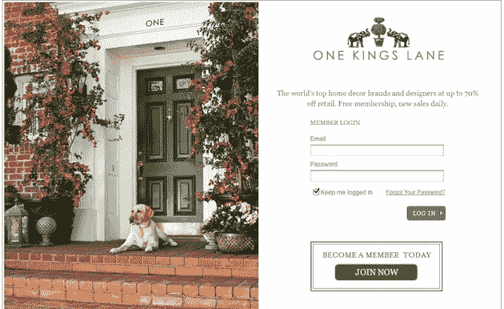

# 电子商务如何重回正轨 TechCrunch

> 原文：<https://web.archive.org/web/http://techcrunch.com/2011/02/11/how-e-commerce-got-its-groove-back/>

 [* James Slavet *](https://web.archive.org/web/20230203123642/http://www.crunchbase.com/person/james-slavet) 是 [Greylock Partners](https://web.archive.org/web/20230203123642/http://www.crunchbase.com/financial-organization/greylock) 的合伙人，刚刚联合领投了 [One Kings Lane](https://web.archive.org/web/20230203123642/http://www.onekingslane.com/) 的新[2300 万美元融资](https://web.archive.org/web/20230203123642/https://techcrunch.com/2011/02/11/one-kings-lane-grows-500-in-2010-takes-23-million-investment/)。

在过去十年的大部分时间里，电子商务是一片创新荒地。尽管 YouTube、LinkedIn、脸书和 Twitter 等社交媒体公司呈指数级增长，但突破性的新商业初创企业却少之又少。正如我们在首轮资本的朋友在这篇博客文章中指出的，网络上 15 个顶级网站中有 7 个是在过去十年中创建的，但 15 个顶级电子商务网站中只有 1 个是在同一时期创建的。谁是新的主要电子商务进入者？嗯，新蛋。

也没有多少令人兴奋的财务结果。我说的不是亚马逊或易贝这样的先驱，而是后来的初创企业。当然，有一些，如捷步达康、Diapers.com 和 Stubhub，但不多。

传统的电子商务企业大多背负着高额的客户获取成本(大量的 Google Adwords 支出)、低客户保持率(一次性交易)以及消耗现金的运营模式(由于仓库堆满了库存)。

但是电子商务市场很大，创新的时机已经成熟。电子商务现在是每年在线广告市场规模的四倍多。然而，只有 4%的渗透率。

更好的模型出现了

推动网络其他领域创新的趋势——社交、本地和移动——现在正在推动电子商务领域出现一类新的机会。几年前，一批企业家开始设计新的社交商务模式，这种创新正在以快速增长的业务形式获得回报。

这类新兴公司的特点是本地商务领域的 Groupon、私人销售领域的 Gilt，以及订阅商务(Shoedazzle)、移动商务(Shopkick)和下一代市场(Airbnb)等领域的早期初创企业。社交商务企业家已经设计出了更好的模式。他们已经用精心策划的、激动人心的、令人上瘾的体验取代了那些缺乏灵感、令人不知所措的消费者体验。他们通过口头宣传降低了客户获取成本，并通过定期重新吸引客户提高了客户终身价值。他们还通过持有很少甚至没有库存，并在向供应商付款之前由客户付款，创造了更高效的运营模式。

现在有数百家初创企业在社交商务领域竞争。在评估 Greylock 的新投资时，我们会问自己，进入赢家圈的少数公司的定义特征是什么？

我们感到兴奋的一家公司是 One Kings Lane，它成立于 2008 年末，总部位于旧金山，是一家很有前途的初创公司。我们今天早上刚刚宣布了对该公司的投资。One Kings Lane 专注于帮助人们找到物超所值的高品质家居和生活产品，如家具、配饰、艺术品、厨具、食品和葡萄酒。我们认为这家公司展示了一些在成功的社交商务初创企业中普遍存在的特征。

左脑，右脑

最成功的社交商务团队将高度发达的左右脑结合在一起。右脑在一家公司的早期就很重要。我所说的右脑指的是识别和传递一种体验的本能和激情，这种体验将以一种深刻、真实的方式与顾客产生共鸣。大多数 v 1.0 电子商务网站似乎没有使用太多的右脑。在社交商务中，体验始于识别独特且难以找到的优秀商品——你不可能在任何地方都能买到。这种体验延伸到讲故事，这样公司就能以一种令人信服的方式描述商品。最终，它被包装在一个品牌和体验中，让顾客兴奋地认同并参与其中。

在电子商务运营中，左脑有永无止境的机会进行测试、迭代和改进。最好的公司无情地处理从最初的客户接触到交易产生的数据。

One Kings Lane 发布团队打造了一流的客户体验。他们通过精心挑选的独特、高品质产品，提供了获得“可获得的奢华”的途径，让家里每天都焕然一新，并以合理的价格出售。一到 One Kings Lane，我就像一位值得信赖、见多识广、时尚的朋友一样，帮助购物者(大多数是女性)找到可以装饰家居和娱乐的好产品，这是他们不懈的追求。正是这个团队运转良好的右脑识别出了真正伟大的发现，并对其进行了有品位的营销。

但 One Kings Lane 的团队，包括首席执行官麦晋桁(Doug Mack)、创始人艾莉森平卡斯(Alison Pincus)和苏珊费尔德曼，以及来自 Walmart.com、易贝、亚马逊、Zappos 和网飞的管理团队，也代表了当今在线零售业中一些更为调谐良好的左脑。

有些团队的大脑在左右两边都很强，但当他们在两边都很强的时候，魔力就来了。

上瘾者和福音传道者

在过去，即使是最知名的电子商务公司增长在一个线性的步伐，并获得了绝大部分的交通通过结合付费营销和 SEO。电子商务并没有通过脸书和 Twitter 迅速崛起，因为大多数人在经典电子商务网站上使用的产品和体验都是为了简单、快速和全面而设计的。它们不够刺激、有趣或有趣，不值得与朋友分享。

让社交商务业务发挥核心作用的，是一种从根本上讲值得分享的体验。分享涉及到社会资本——当你和朋友分享某件蹩脚的东西时，你从他的社会资本账户中取出了一笔存款；当你分享了某件很酷的东西时，你就获得了社会资本。

大多数社交商务公司确实会在营销上花钱(在某些情况下会花很多钱)，但关键的区别在于，他们在付费营销上的投资回报率会被高终身价值客户(上瘾者)和病毒式传播(传播者)放大。这种放大效应让突破性的社交商务公司的股价呈指数级增长，同时提高了它们的防御性。当客户沉迷其中，并愿意传染给他们的朋友时，强大的公司就会变得更加强大，变得更加难以击败。

我第一次发现 One Kings Lane 是通过我妻子和她的朋友。我们这一带的女人都显出一副沉迷于一个国王胡同的样子。激发这种日常习惯的在线产品是不寻常的。one King’s Lane 的客户是他们最伟大的捍卫者，公司正在通过口碑获得大多数客户。

市场，而不仅仅是机制

社交商务公司正在采用一系列机制，这些机制已被证明在推动其他现有社交产品的用户行为方面取得了成功，包括基于邀请的访问、限时销售、每日电子邮件、与朋友推荐和成就挂钩的优惠。随着时间的推移，我认为我们会看到更多的电子商务公司试图复制现有参与者的机制。有些会在这些特性上执行得很好，但大多数不会。

但新的有价值的社交商务业务的最终驱动力将基于该公司正在应对的潜在市场的潜力。市场够大吗？是现有选手发球差？

我们被 One Kings Lane 的垂直焦点所吸引。很少有消费垂直市场不是由现有的在线品牌主导的。家居装饰产品市场规模庞大，服务不足:1500 亿美元。想想这个问题:今天谁是家居装饰产品的定义性网络原生电子商务品牌？它不存在。Williams Sonoma 年收入数十亿美元，但缺乏独特的选择。该领域存在大量的供应商分散，这使得消费者很难发现新品牌。

One Kings Lane 正在成为家居装饰垂直行业的领先电子商务玩家，商机不仅仅是日常电子邮件或活动，而是成功应对一个巨大的、服务不足的市场。

新一代突破性的社交商务公司正在崛起。这是一个令人兴奋的购物时间！

*披露:Greylock Partners 投资了本文提到的一些公司:Airbnb、脸书、Groupon、LinkedIn、One Kings Lane 和 Shopkick。

这篇文章也发表在 Greylock Partners 的博客[这里](https://web.archive.org/web/20230203123642/http://greylockvc.com/2011/02/11/how-e-commerce-got-its-groove-back/)。