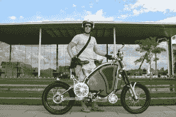

# 赛格威 2.0？德国自行车进入美国 TechCrunch

> 原文：<https://web.archive.org/web/http://techcrunch.com/2011/02/11/segway-2-0-german-bicycle-on-steriods-comes-to-the-us/>

 不管公平不公平，德国的网络企业家因抄袭而名声不好。如果斯特凡·古拉斯有代表性的话，那么德国企业家就不一样了，他们生产……我猜你们会称之为未来派的电动自行车。

古拉斯在过去的六年里建造了一种叫做 [eROCKIT](https://web.archive.org/web/20230202234820/http://www.erockit.net/) 的东西，它不属于交通工具的范畴。与摩托车不同，它是主动的——你必须踩踏板才能让它走。但与电动自行车不同，它跑得非常快。速度之快超过了一辆汽车。它完全是电动的，借用了一些技术，看起来像你家的健身车。

令人惊讶的是，古拉斯自举，没有任何真正的车辆工程知识。他以每幅约 1.2 万欧元的价格卖出了 40 幅。最大的瓶颈是生产，所以古拉斯在城里寻找投资者。对于 TechCrunchTV 来说，可悲的是，他实际上并没有带着 eROCKIT，但看着人们骑着它并与它互动的视频，有一件事是清楚的——这款设备有一种让人着迷的东西让人微笑。

这让我想起了赛格威。你坐在上面靠着，突然你穿过一个房间。我们办公室里有一个，每个坐上去的人都会忍不住大笑。类似地，你骑上 eROCKIT，踩下踏板，期待自行车正常加速的根深蒂固的感觉记忆，当这东西刚刚起飞时，最高时速为 50 英里，充电之间的距离为 45 英里。eROCKIT 看起来比赛格威更酷。(不难。)古拉斯有一个 3 英寸厚的剪报活页夹——这一切都是从一名电视记者着迷地看着他开着它在柏林兜风开始的。

古拉斯关于他为什么创建这家公司的故事读起来像是一个自行车手的终极复仇幻想。他喜欢骑自行车，并觉得这给了他在路上的“道德优越感”，但在其他方面，他处于交通运输的低端。任何一个骑自行车的人，只要他愤怒地喊道:“共享道路！”汽车会对这种比汽车有更大加速能力的产品微笑，对环境友好同样满意，同时还能得到锻炼。“你觉得自己是超级人类，”他兴奋地说。“你是马路之王！”

古拉斯认为这种奇怪的动力踏板将会改变运输世界，所有的汽车都将变得更加活跃。我不同意。我更倾向于谷歌自动驾驶汽车的多任务处理未来，而不是回到燧石族的汽车。但我可以看到，在旧金山这样的城市里，自行车是巨大的，那里几乎每天都阳光明媚，是地球上最积极的自行车文化之一的家园。

如果能够完成这轮融资，Gulas 希望将公司总部迁至加州。他喜欢该公司的德国工程传统，但表示欧洲投资者觉得这个项目太怪异了。在美国的短短几周内，投资者的反应就像白天和黑夜一样不同。虽然在欧洲受到的打击是他没有一个可供他们评估的市场，但他说，这里的投资者已经表示，他们感兴趣的是缺乏一个现有的、明确的市场。

在一个奇怪的全球化扭曲中，他预计在这里制造自行车会更便宜，因为一些材料来自美国，最明显的是 A123 电池。不管怎样，他希望明年开始在这里销售。

下面是一些 eROCKIT 的视频。
【YouTube = http://www . YouTube . com/watch？v = tjQz _ cyjsh 4]
【YouTube = http://www . YouTube . com/watch？v=tzsHFka92X8 &功能=相关]