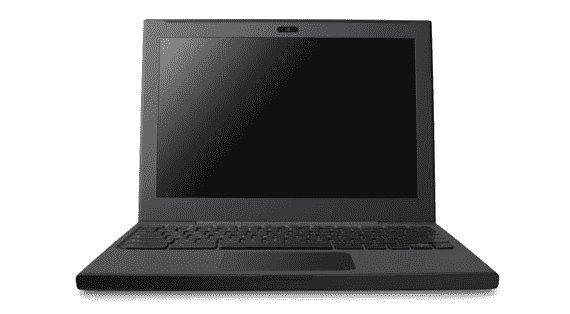

# TechCrunch 赠品:谷歌 Chrome Cr-48 笔记本#TechCrunch

> 原文：<https://web.archive.org/web/http://techcrunch.com/2011/02/11/techcrunch-giveaway-a-google-chrome-cr-48-notebook-techcrunch/?utm_source=feedburner&utm_medium=feed&utm_campaign=Feed%3A+Techcrunch+(TechCrunch>&utm_content=Google+Reader)

# 免费赠品:一台谷歌 Chrome Cr-48 笔记本

 通常我们会写一点我们正在送出的东西，但这不需要任何介绍。所以，我们要保持简单。

我们有 1 台[谷歌 Chrome Cr-48 笔记本](https://web.archive.org/web/20230202235857/http://www.google.com/chromeos/pilot-program-cr48.html)要送出！

你可以在这里阅读我们对它的广泛评论[。](https://web.archive.org/web/20230202235857/https://techcrunch.com/2010/12/12/cr-48-chrome-notebook-review/)

如果你想赢得一台 Cr-48 笔记本电脑，只需按照以下步骤进入。

1) **成为我们 TechCrunch 脸书页面的粉丝:**

2) **然后执行下列操作之一:**

–转发这篇文章(确保包含#TechCrunch 标签)
–或者在下面给我们留言，解释你为什么想要一个

比赛现在开始，明天，太平洋时间 2 月 12 日下午 7:30 结束。

请只发一次信息，否则你将被取消资格。我们将随机选择，并在本周末联系获胜者，了解更多细节。世界上任何人都有资格，只要你能收到递送的包裹。祝大家好运。

更新:比赛结束。一旦我们有了获胜者，我们将更新帖子。

更新:祝贺 Chavon Riggins 获奖！