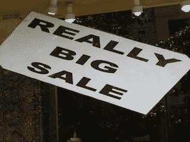
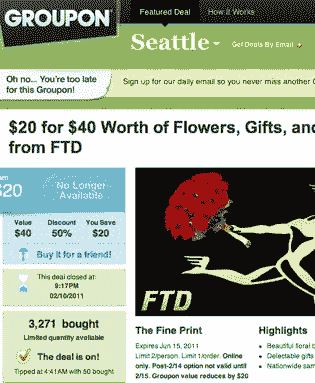

# 情人节诱饵&开关:Groupon 必须避免成为又一个无用的优惠券网站

> 原文：<https://web.archive.org/web/http://techcrunch.com/2011/02/11/valentines-day-bait-switch-groupon-must-avoid-becoming-just-another-useless-coupon-site/>

我假设“销售！”零售业的招牌通常都是废话。商店将正常价格保持在高于应有的水平，这样他们就可以给顾客提供虚假的折扣。是永远正确还是经常正确并不重要。人们不会真的对“大减价 50%”之类的标语感到兴奋。我们对它已经麻木了。

然而，Groupon 有所不同。他们得到了实实在在的折扣，明显低于正常的零售价格。这就是为什么数千万人每天都期待着他们的 Groupon 电子邮件，也是为什么这么多人报名参加他们从来不知道自己想要的跳伞课程。

不过，有迹象表明，这种模式可能不会永远无限扩大。我的意思是，超越常识。例如，一些商家在看到 Groupon 带来的巨大销量时，没有接受他们已经在 Groupon 上售出的优惠券。

在这种情况下，Groupon 似乎在向不满意的顾客退款方面做得非常好。通过这样做，他们保持了自己的品牌强势，成为了获得真正好交易的代名词。

但不是今天。

 Groupon 为全美用户提供 20 美元优惠券，用于购买 FTD 的情人节鲜花。购买优惠券的人必须使用一个特殊的网址来购买鲜花。然后，在 20 美元的优惠券之前，他们看到了 50 美元的鲜花的正常价格。

这很好，除了常规的 FTD 网站显示同样的商品价格为 40 美元，这意味着 Groupon 用户只得到 10 美元的折扣，而不是 20 美元。

这是各种各样的事情。FTD 开始做虚假广告，因为他们对 Groupon 用户和没有 Groupon 链接来 FTD 的人显示不同的零售价格。用户们说，只有通过 Groupon 链接，优惠券才有效。

对这项服务还有其他抱怨，比如 FTD 把送货时间推迟到 2 月 15 日，还收取服务费。那些东西很讨厌。但不同的价位才是真正让我担心的。

Groupon 要想继续增长，他们需要获得更多的大型全国性广告客户，而这些广告客户不应该玩弄客户信任。[Gap 活动](https://web.archive.org/web/20230203024111/https://techcrunch.com/2010/08/19/groupon-gap-deals-discounts-andrew-mason/)处理得很好。这个 FTD“交易”不是。

像这样糟糕的交易伤害了 Groupon 的品牌，因为被烧伤的顾客不会那么渴望查看新的每日交易。他们只会认为这是一个骗局，并忽略这一切。就像那些大甩卖一样！你最喜欢的零售店橱窗上的标志。

[图片来源](https://web.archive.org/web/20230203024111/http://www.flickr.com/photos/jcberk/3782996514/)(第一张图片)

**更新:** Groupon 在下面的评论中做出回应。除此之外，对于用户支付的高于 FTD 提供给其他所有人的零售价格的差额，他们会自动退款。

> 嘿大家好，
> 
> 这是乔·哈罗。我是 Groupon 的客服主管。
> 
> 首先，我们完全了解每个人的想法——我们昨晚发现了这个问题，并一直在努力纠正它。
> 
> 我们刚刚向购买了该 Groupon 的所有人发送了一份通知，解释了我们正在做的事情:
> 
> 首先，我们与 FTD 合作，使 Groupon 对减价商品有效。作为顾客，我们也对最初的价格表示感到困惑。
> 
> 第二，任何已经用他们的 Groupon 从 FTD 购买了打折商品的人都会自动从他们的卡上收到退款，以弥补他们支付的差价。
> 
> 对我们来说，没有什么比培养客户的信任更重要的了，我们知道最好的方法是持续提供没有“陷阱”的优惠感谢每一个表达他们的失望并提醒我们注意此事的人。