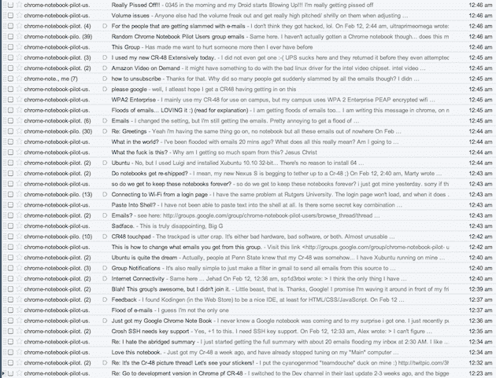

# 谷歌 CR-48 笔记本用户(和满怀希望的用户)被谷歌群发垃圾邮件围困

> 原文：<https://web.archive.org/web/http://techcrunch.com/2011/02/12/google-cr-48-notebook-owners-and-hopeful-owners-besieged-with-flood-of-google-group-spam/>

# 谷歌 CR-48 笔记本用户(和满怀希望的用户)被谷歌群发垃圾邮件围困

我们仍在试图弄清楚到底发生了什么，但是[谷歌 CR-48 笔记本](https://web.archive.org/web/20230203010156/https://techcrunch.com/2010/12/12/cr-48-chrome-notebook-review/)的拥有者，甚至一些刚刚注册获得一台但还没有的人，今天晚上开始收到几十封，然后超过 100 封电子邮件。这一切开始于太平洋时间上午 12:23 左右。

为什么？人们似乎被自动添加到了这个谷歌群组——[http://groups.google.com/group/chrome-notebook-pilot-users](https://web.archive.org/web/20230203010156/http://groups.google.com/group/chrome-notebook-pilot-users)——然后每隔一两分钟，电子邮件就开始流动。当人们开始发帖要求停止垃圾邮件时，一分钟内会有很多次，然后这些信息会被发送给每个成员。一名线人在 20 分钟内收到 100 多封电子邮件后退订了该群。另一个人说他们退订前在速射得到 89。

来自一个线人:

> 就在几分钟前，我开始收到大量来自谷歌 chrome 试用用户组 chrome-notebook-pilot-users@googlegroups.com 的通知邮件。从一些评论来看，我不认为我是唯一的一个。似乎有人自动将人添加到了群中，电子邮件通知开始一个接一个地到来。从凌晨 2:14 到 2:40 有 89 封邮件。我不得不创建一个过滤器来阻止电子邮件的冲击，然后进入谷歌群组设置，将其设置为“无电子邮件”，但我自己从未注册过。似乎有人变坏了。

我们将更新更多的信息，因为我们得到它。以下是发布的一些消息:

> 主题:这他妈的是什么？
> 致:Chrome 笔记本试点用户
> 为什么我会收到这么多垃圾邮件？上帝啊。

> 主题:这组人
> 致:Chrome 笔记本试用用户
> 这让我比以往任何时候都更想伤害别人！

> 主题:真的很生气！！
> To: Chrome 笔记本试用用户
> 0345 早上，我的 Droid 开始爆炸！！！
> 我真的要被气死了！！！

> > >我从来没有得到过 Chrome OS 笔记本，但我最近开始收到这个群体的
> > >封邮件。这是否意味着我已经被选中，应该很快就会有 Chrome OS 笔记本了？我去年 12 月初
> > >或 11 月底申请的，直到现在都没有任何消息。

> >我的处境完全一样。5 分钟前，我开始收到来自这个群组的大量电子邮件
> >，但从未收到过笔记本。我应该寻找一个吗？

**更新:** [谷歌解释，为 CR-48 垃圾邮件道歉](https://web.archive.org/web/20230203010156/https://techcrunch.com/2011/02/12/google-explains-apologizes-for-cr-48-spam/)