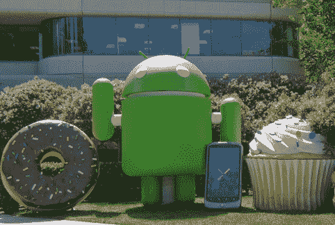

# 我刚把自己男性化了。Droid 从来没有这么好看过。TechCrunch

> 原文：<https://web.archive.org/web/http://techcrunch.com/2011/02/14/i-just-androidified-myself-droids-never-looked-so-good/>

# 我刚把自己男性化了。Droid 从来没有这么好看过。

到现在为止，你可能已经熟悉了谷歌友好的绿色安卓机器人，它会出现在安卓活动和各种新闻材料中(谷歌园区的安卓大楼前也有一个巨型版本)。而且，如果你像我一样，你总是希望有一种方法可以按照你自己的形象重塑这个机器人——我知道我经常发现自己在机器人身上涂鸦眼镜和凌乱的黑发，无论何时我看到它。但是现在有了更好的方法。

今天，谷歌发布了一款有趣的新应用，名为 [Androidify](https://web.archive.org/web/20230203024009/http://androidify.com/) 。这并不完全有用，但它是一个有趣的消遣:启动它，你可以从各种体型、服装和配件中选择，制作你自己的定制 Android 机器人(如果你曾经在任天堂的 Wii 上创建过 Mii，这应该非常熟悉)。完成后，你可以将头像发送到各种社交网络，将其更改为手机的壁纸、好友的联系人图标等等。

这个应用程序是由谷歌创意实验室和[幼虫实验室](https://web.archive.org/web/20230203024009/http://www.larvalabs.com/)联合开发的。你可以在 Android Market 上的这里找到应用[(记住，这是 Market 的新网页版本，所以你可以直接将应用发送到你的手机上)。](https://web.archive.org/web/20230203024009/https://market.android.com/details?id=com.google.android.apps.androidify)

为了加分，给你的情人做一个这样的，并拍下他们的反应。

【YouTube = http://www . YouTube . com/watch？v = irh 3 oso skce & HL = en _ US & feature = player _ embedded & version = 3]

