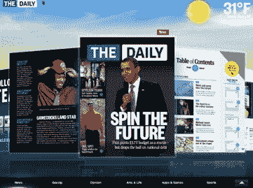

# TMZ 和日报有什么共同之处？两者都发表在 Crowd Fusion TechCrunch 上

> 原文：<https://web.archive.org/web/http://techcrunch.com/2011/02/15/tmz-daily-crowd-fusion/>

# TMZ 和日报有什么共同之处？两者都发表在《人群融合》上

几周前，在[的首次亮相*的*](https://web.archive.org/web/20230203015634/https://techcrunch.com/2011/02/02/rupert-murdoch-new-times-demand-new-journalism/)日报上，除了媒体和博客作者，一些与该项目相关的科技公司首席执行官也在四处走动。其中之一是布莱恩·阿尔维，他是[人群融合](https://web.archive.org/web/20230203015634/http://www.crowdfusion.com/)的创始人，这是一个内容管理系统(CMS ),由[在 2009 年的 TechCrunch 50 上推出](https://web.archive.org/web/20230203015634/https://techcrunch.com/2009/09/15/tc50-crowdfusion-merges-the-best-features-of-blogs-wikis-and-more-into-one-unified-cms/),但自那以后一直相当安静。

阿尔维一直忙于在大型媒体网站上注册客户。据我所知，日报和名人八卦网站 TMZ 都发表在人群融合上。对于日报来说，新闻集团需要一个能够支持其数字新闻编辑室的发布平台。Crowd Fusion 发布 iPad 应用程序中的所有页面(以及相应的网页)，并支持社交分享功能和语音评论。它从数十个来源和订阅源获取照片、视频、文章和其他信息，然后每天将这些信息汇集到出版物中。当然，它也是第一个与苹果新的[订阅计费服务](https://web.archive.org/web/20230203015634/https://techcrunch.com/2011/02/15/apple-launches-subscriptions-for-content-publishers-on-the-app-store/)配合使用的应用程序。

Crowd Fusion 不得不为《每日新闻》重新构建 CMS 三次，因为 iPad 报纸雇佣了更多的人员，并改进了每天发布内容所需的工作流程。人群融合足够灵活来处理这个问题。此外，它将内容视为结构化的数据库，使相关的故事、视频、照片等更容易呈现出来。