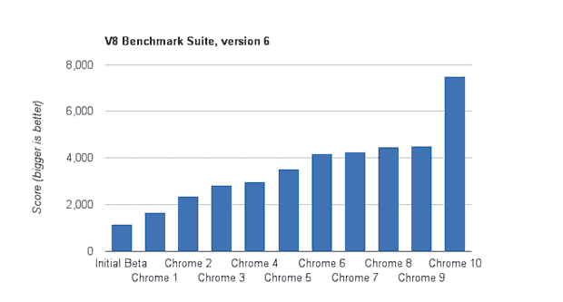

# 随着 Chrome 10 进入测试版，兔年开始了

> 原文：<https://web.archive.org/web/http://techcrunch.com/2011/02/17/chrome-10-crankshaft/>

# 随着 Chrome 10 通过“曲轴”JavaScript 进入测试版，“兔年”开始了

正如他们在过去几个月里非常清楚地表明的那样，[谷歌](https://web.archive.org/web/20230203014627/https://techcrunch.com/2010/07/22/google-chrome-versions/) [讨厌](https://web.archive.org/web/20230203014627/https://techcrunch.com/2010/12/02/chrome-8-2/) [谈论](https://web.archive.org/web/20230203014627/https://techcrunch.com/2010/10/22/chrome-8/)Chrome 的版本号。

嗯，除非他们有话要说。实际上是[通常是](https://web.archive.org/web/20230203014627/https://techcrunch.com/2011/02/03/google-chrome-9/)。

今天[带来了另一个帖子](https://web.archive.org/web/20230203014627/http://chrome.blogspot.com/2011/02/faster-than-speeding-rabbit-speed-sync.html)，强调了 Chrome 10 的一些新功能，Chrome 10 刚刚进入浏览器的测试版。

谷歌写道:“本着农历新年的精神，我们很高兴以 Chrome beta 频道的一系列增强功能开始兔年。你可以在这里找到 Chrome 10 beta [的新功能和改进的完整列表](https://web.archive.org/web/20230203014627/http://googlechromereleases.blogspot.com/2011/02/chrome-beta-release.html)，包括密码同步、GPU 加速视频和新的设置选项卡。但 Chrome 10 的关键还是速度。

具体来说，JavaScript 速度。Chrome 10 使用最新版本的 V8 引擎，他们称之为“曲轴”。谷歌[在去年 12 月的 Chrome 操作系统/网络商店活动的舞台上预览了](https://web.archive.org/web/20230203014627/https://techcrunch.com/2010/12/07/chrome-browser-120-million/),它正在 Chrome(Chrome 所基于的开源浏览器)和 Chrome 的开发者版本中进行测试。但现在它显然准备好了黄金时间，因为谷歌在不止一个，而是两个帖子中吹捧它。

谷歌写道:

> Chrome 的 JavaScript 引擎 V8 运行计算密集型 JavaScript 应用程序的速度比以前更快。事实上，这个测试版本在 V8 基准测试套件上比我们当前的稳定版本有 66%的巨大改进。

下面的基准测试图将这个版本的 JavaScript 引擎与以前的版本进行了比较，结果非常惊人。

你可以在这里找到 Chrome [的测试版](https://web.archive.org/web/20230203014627/http://www.google.com/intl/en/landing/chrome/beta/)。显然，谷歌认为它还没有经过足够的测试来完全稳定。但我正在上面写这篇文章。它看起来很坚固——是的，很快。

*【图片:flickr/ [机器人波波](https://web.archive.org/web/20230203014627/http://www.flickr.com/photos/45493477@N05/4178051127/)*