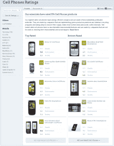

# GoodGuide 对手机可持续性进行排名:RIM 最差，诺基亚最佳 TechCrunch

> 原文：<https://web.archive.org/web/http://techcrunch.com/2011/02/17/goodguide-new-mobile-rankings/?utm_source=feedburner&utm_medium=feed&utm_campaign=Feed%3A+Techcrunch+(TechCrunch>)

 ** *点击图像，右键，放大。***

今天，GoodGuide(一家由校友组成的公司)在其综合数据库中增加了手机排名，该数据库对产品的环境和社会性能以及制造这些产品的公司进行了排名。

在新的手机类别中，这家旧金山初创公司对美国市场 16 家顶级手机制造商的 576 款不同手机和充电器进行了排名。 [GoodGuide](https://web.archive.org/web/20230203022403/http://www.goodguide.com/) 评估了一切，从进入手机的“成分”,到每台设备的能效、可回收质量，以及制造商披露其供应链、材料等细节的意愿。

对于公司整体的环境表现和影响: [RIM](https://web.archive.org/web/20230203022403/https://techcrunch.com/search/?cx=003873551773381066500%3An5h_ivbx_us&cof=FORID%3A11&ie=UTF-8&q=RIM&sa=Search&siteurl=beta.techcrunch.com%252F#1316) 垫底，[诺基亚](https://web.archive.org/web/20230203022403/https://techcrunch.com/search/?cx=003873551773381066500%3An5h_ivbx_us&cof=FORID%3A11&ie=UTF-8&q=Nokia&sa=Search&siteurl=beta.techcrunch.com%2F#979)荣登 GoodGuide 环境排行榜榜首，[苹果](https://web.archive.org/web/20230203022403/https://techcrunch.com/search/?cx=003873551773381066500%3An5h_ivbx_us&cof=FORID%3A11&ie=UTF-8&q=Apple&sa=Search&siteurl=beta.techcrunch.com%252F#953)位居第三。

尽管苹果公司整体表现强劲，但它的 iPhone 手机还是打破了 GoodGuide 最环保设备排行榜的前十五名。诺基亚 C6 手机获得最高荣誉，紧随其后的是三星的蓝色地球手机。RIM 的黑莓 Bold 9000 智能手机是评价最差的手机。【编者注:更多评级见上面截图。]

GoodGuide 创始人 Dara O'Rourke 解释了为什么苹果公司被视为一家公司，但其手机却没有被评为环保产品:

> “苹果本周发布了新的供应商责任报告，为公司赢得了分数。
> 
> 然而，直到今年，苹果甚至不能告诉你他们的手机中有什么金属或矿物，或者它们来自哪里……和其他移动制造商一样，他们的立场一直是:我们不能告诉你我们的手机中是否有冲突矿物，我们也不能告诉你是谁制造了其中的一个子组件——这是专有的、有竞争力的，或者不是我们知道的东西。
> 
> 现在，是 2011 年了。该行业正在努力弥补所有这些不足。消费者要求知道更多。尽管如此，苹果公司仍然没有透露他们 iPhones 的很多细节。每种产品缺乏透明度使得 iPhone 和黑莓在产品排名中排名靠后。"

多德-弗兰克华尔街改革和消费者保护法案可能很快会要求手机制造商披露这些细节。

为 GoodGuide 领导手机研究的科学家 Pedro Vieira 表示，为了得出产品得分，该公司授权并汇编了来自政府、学术、商业和独立研究机构的研究，并加入了一些他们自己的专有数据。该公司为每项研究分配一个权重，这样一来，公司提供的关于其产品的声明将不如独立的科学实验室对同一项目的研究有价值。

不同于其他关于手机的可持续发展报告——如英国市场的 [O2 Ecoratings](https://web.archive.org/web/20230203022403/http://www.o2.co.uk/thinkbig/planet/sustainableproducts/ecorating) 或[绿色和平组织的绿色电子产品指南](https://web.archive.org/web/20230203022403/http://www.greenpeace.org/international/en/campaigns/toxics/electronics/Guide-to-Greener-Electronics/)——good Guide 将环境和社会影响作为单独的分数进行报告，提供公司和产品级别的分数，并为认为这可能造成健康风险的消费者提供有关手机辐射水平的信息(不计入他们的分数)。

奥洛克指出，最终，他的公司旨在帮助人们找到符合他们自己的社会、健康和环境问题的品牌和产品，但不想倡导这些价值观应该是什么，或者他们应该选择哪些品牌。他不相信 GoodGuide 的分数会说服最拥护树木、最喜欢吃格兰诺拉麦片的苹果粉丝转向诺基亚。然而，他希望这样的评级会给消费者动力，迫使他们购买的公司尽可能透明，并提高他们产品和经营的可持续性。

*GoodGuide 的十大最环保手机制造商名单包括:* 

1.[诺基亚](https://web.archive.org/web/20230203022403/http://goodguide.com/products?brand_id=332299-nokia&category_id=332304-cell-phones)
2。[索爱](https://web.archive.org/web/20230203022403/http://goodguide.com/products?brand_id=332303-sony-ericsson&category_id=332304-cell-phones)3
。[苹果](https://web.archive.org/web/20230203022403/http://goodguide.com/products?brand_id=277508-apple-computer&category_id=332304-cell-phones)
4。[泛泰](https://web.archive.org/web/20230203022403/http://goodguide.com/products?brand_id=332301-pantech&category_id=332304-cell-phones)
5。[手掌](https://web.archive.org/web/20230203022403/http://goodguide.com/products?brand_id=332300-palm&category_id=332304-cell-phones)手掌
6。[京瓷三洋](https://web.archive.org/web/20230203022403/http://goodguide.com/products?brand_id=332297-kyocera-sanyo&category_id=332304-cell-phones)7。[摩托罗拉](https://web.archive.org/web/20230203022403/http://goodguide.com/products?brand_id=332298-motorola&category_id=332304-cell-phones)8。[HTC](https://web.archive.org/web/20230203022403/http://goodguide.com/products?brand_id=332295-htc&category_id=332304-cell-phones)9。[三星](https://web.archive.org/web/20230203022403/http://goodguide.com/products?brand_id=277532-samsung&category_id=332304-cell-phones)
10。库里特尔