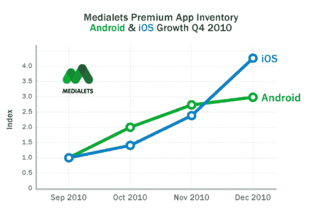
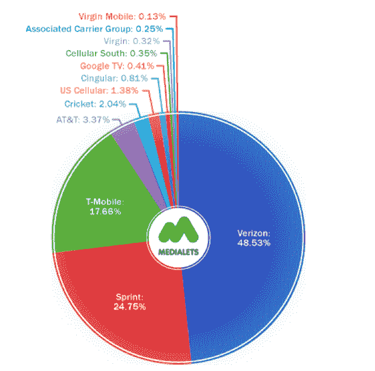
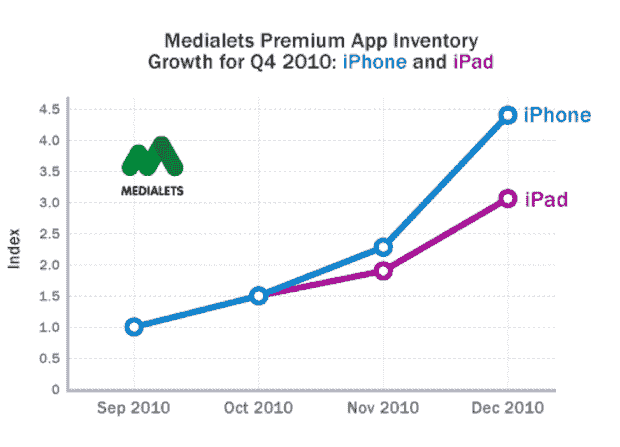

# 从一个优质广告平台 TechCrunch 上鸟瞰 iOS 和 Android

> 原文：<https://web.archive.org/web/http://techcrunch.com/2011/02/17/ios-versus-android-apps/>

比较 iOS 和 Android 平台通常很棘手，因为视角通常是片面的。但移动广告平台往往对事物的状态有一个非常全面的看法，因为它们在 iOS 与 Android 的宗教战争中是不可知论者。其中， [Medialets](https://web.archive.org/web/20230203002047/http://www.medialets.com/) 有着最好的视角，因为他们的数据只来自大规模应用程序制造商，这些制造商往往在两个平台上都有。像 Pandora、纽约时报、Fandango、CNN、天气频道等应用程序。换句话说，就是“高级应用程序”。那么他们看到了什么？

首先，显而易见的是，手机正在全面爆发。Medialets 表示，他们的优质库存在 2010 年第四季度增长了近 300%。在过去的几年里，几乎你读过的每一份报告都会说同样的话。

尽管 Medialets 承认 Android 在美国的市场份额已经超过了 iOS，但 iOS 仍然在他们服务的高端品牌中占据主导地位。这些高级应用在 iOS 上的运行速度更快，因此 Medialets 为它们提供了更多的库存。就增长而言，Android 已经领先了几个月，但 iOS 在假期中占据主导地位。

就 Android 碎片而言，Medialets 也承认这是非常真实的，但对于这些优质应用来说，这似乎不是一个问题。从设备的角度来看，运行这些应用的前 3 名 Android 设备占了 Medialets 在 Android 上提供的优质库存的大约 35%。前 10 种设备占 63%。

这些顶级安卓设备是什么？Medialets 的数据指向 Droid、EVO4G、Droid X、Incredible 和 Droid 2。鉴于这份名单，Verzon 在 Android 运营商传播媒体方面占据主导地位就不足为奇了。美国最大的航空公司占有大约 48.5%的市场份额。Sprint 以 24%的份额位居第二。然后是 17%的 T-Mobile。美国电话电报公司呢？一直下降到只有 3%。

当然，最有趣的事情是，现在 iPhone 在美国电话电报公司和威瑞森都可以买到了，会发生什么？显然，美国电话电报公司已经开始比以前更多地推广 Android。但数据是否表明，当一家运营商同时提供 iPhone 和 Android 手机时，大多数人会选择 iPhone？至少在 Medialets 看来是这样的。

在安卓制造商方面，HTC 以 38%的份额领先。摩托罗拉以 34%位居第二。三星的份额不到 20%。然后还有一群小得多的人。

在 iPad 和 iPhone 领域，正如[苹果自己的销售数据](https://web.archive.org/web/20230203002047/https://techcrunch.com/2011/01/18/apple-q1-2011/)所显示的，两者都见证了假期时间的巨大增长。是的，在 Medialets 提供的库存方面，iPhone sill 明显领先于它的大兄弟。

分解 iOS，68%的用户使用 iOS 4.x。基本上其余 32%的用户都使用 iOS 3.x。这些数字没有最近谈到的 90%的 iOS 4.x 数字那么惊人，但它们仍然表明碎片化远不是 Android 上的问题。

就谁在购买 Medialets 的优质广告位而言，目前主要是汽车公司，仅占 35%左右。后面是餐馆，然后是娱乐。

