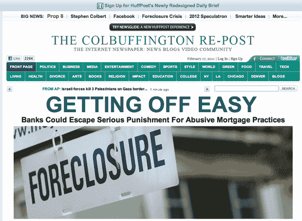

# 史蒂芬·科拜尔推出《赫芬顿邮报》模仿版《科尔巴芬顿邮报》

> 原文：<https://web.archive.org/web/http://techcrunch.com/2011/02/17/techcrunch-repost/?utm_source=feedburner&utm_medium=feed&utm_campaign=Feed%3A+Techcrunch+(TechCrunch>)

# 史蒂芬·科拜尔推出《赫芬顿邮报》模仿版《科尔巴芬顿邮报》

[tc_dailyshow id="374546"]

除了莎拉和保罗奇怪的基于比伯的搜索引擎优化尝试，自从一些美国在线的人和阿里安娜·赫芬顿成为我的超级老板后，我没有注意到这里有太多的变化。我的意思是，我仍然得到工作和一切很酷的东西，所以+ 1！

但是真的，我的 [AOL 帽子](https://web.archive.org/web/20230203000147/http://www.telegraph.co.uk/technology/8323190/Silicon-Valley-an-apology.html)真的不足以阻止我绝对热爱史蒂芬·科拜尔[刚刚做的事情](https://web.archive.org/web/20230203000147/http://www.colbertnation.com/home)，尖锐尖锐地批评[赫芬顿邮报](https://web.archive.org/web/20230203000147/http://www.thehuffingtonpost.com/)有争议的内容实践。

在他今晚的节目中，科尔伯特对阿里安娜·赫芬顿一直在兜售的“科尔伯特报告”和其他免费内容感到沮丧，他宣布他将建立自己的网站，并称之为“科尔巴芬顿邮报”《科尔巴芬顿邮报》有*“你喜欢《赫芬顿邮报》的一切，因为它是《赫芬顿邮报》，周围有新的边框，上面写着《科尔巴芬顿邮报》。”*

事实上，除了当你真正访问 TheColbuffingtonRepost.com 时，它真的提供了一份带有史蒂芬·科拜尔 Colbuffington Re-Post 标志的《赫芬顿邮报》。a)我不确定这是否合法。b)等着瞧吧，直到 Arianna 得到这个。

当然，《赫芬顿邮报》可能会重新发布这个故事，并以某种方式找到将其全部货币化的方法，我们也确实获得了流量(谢谢你的免费内容斯蒂芬)……但除了这在 eCPM 或这些天的商业模式方面意味着什么之外，我们作为媒体的消费者和生产者必须坐下来，欣赏科尔巴芬顿重新发布的纯粹的独创性，至少暂时如此。你赢了科尔伯特。

上述片段中值得注意的引文:

“我是互联网的忠实粉丝，它可以回答任何问题，从‘我在哪里可以买到一条裤子？’到“色情在哪里？”“哦，男孩，我在哪里可以再买一条裤子？””

《赫芬顿邮报》以广泛全面地报道其他人制作并放到互联网上的东西而闻名

*“希望《赫芬顿邮报》将成为美国在线新的收入来源，美国在线的收入目前依赖于 82 岁的特拉华州居民克莱尔·梅耶斯(Claire Meyers)和她仍然支付的每小时 10 美元的拨号服务。”*

你完成了一项不可能的任务，你让我看着自己的照片感到愤怒

*“我的钱在哪里，阿里安娜？不要让我戴上戒指"*

*“我很自豪地宣布科尔巴芬顿邮报以 3.16 亿美元的价格出售。如果我找到一个买家，我保证给你和你给我一样的份额。”*

哎哟。

