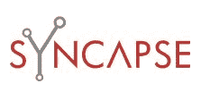

# 社交媒体技术公司 Syncapse 获得 2500 万美元 TechCrunch

> 原文：<https://web.archive.org/web/http://techcrunch.com/2011/02/24/social-media-technology-company-syncapse-scores-25-million-round/>

# 社交媒体技术公司 Syncapse 获得 2500 万美元

将自己标榜为社交媒体技术公司的 [Syncapse](https://web.archive.org/web/20230203093849/http://www.crunchbase.com/company/syncapse) 已经从增长型股权投资者 [ABS Capital Partners](https://web.archive.org/web/20230203093849/http://www.crunchbase.com/financial-organization/abs-capital-partners) 获得了 2500 万美元的融资，其中 2000 万美元已经完成。

ABS Capital 的普通合伙人 Ralph Terkowitz 和 Deric Emry 将加入 Syncapse 的董事会。

这是 Syncapse 的第一笔机构投资——该公司早些时候从加拿大商业发展银行获得了 330 万美元的融资和 200 万美元的融资。

Syncapse 提供基于云的软件和服务，帮助企业构建、管理、标准化和衡量其社交媒体存在。该公司表示，将利用这笔资金投资于其 Syncapse 平台的销售、营销和产品开发，该平台使公司能够在一个单一的集中环境中管理所有的社交媒体营销。

Syncapse 的客户包括 RIM /黑莓、联合利华、索尼和 EA。

该公司的董事会成员明显包括[包括](https://web.archive.org/web/20230203093849/https://techcrunch.com/2010/06/03/former-macromedia-ceo-and-adobe-board-member-rob-burgess-joins-syncapse-board/)[Macromedia 前首席执行官罗布·伯吉斯](https://web.archive.org/web/20230203093849/http://www.adobe.com/macromedia/proom/corpinfo/bios/rkb.html)和笛卡尔系统集团主席伊恩·吉芬。

Syncapse 最近出现在新闻中，它收购了总部位于伦敦的社交媒体开发公司，推动了社交媒体的发展。