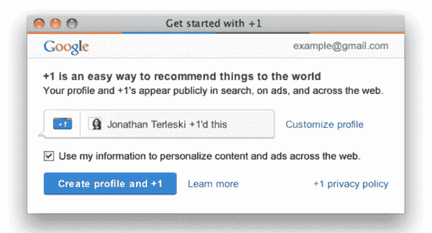
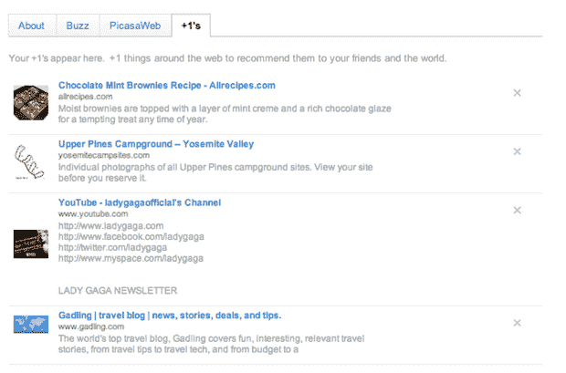

# 有了+1，谷歌搜索真正社会化了——谷歌广告 TechCrunch 也是如此

> 原文：<https://web.archive.org/web/https://techcrunch.com/2011/03/30/google-plus-one/>

回到去年 12 月初，[我们第一次报道](https://web.archive.org/web/20230203012612/https://techcrunch.com/2010/12/02/google-plus-one-brin/)谷歌正在为一款即将推出的社交产品考虑“+1”这个名字。当时，我们被告知这有点像谷歌版的“喜欢”或“转发”按钮。今天，它正式推出，作为一种与你的朋友和更广泛的网络分享你喜欢的谷歌搜索结果的方式。哦，这也是一种将社交注入谷歌广告的方式。

需要澄清的是，今天开始推出的+1 版本不是我们在 12 月第一次看到的[工具栏版本，这显然是一个正在测试的不同版本。这个版本的+1 实际上是一个小按钮，将驻留在每一个谷歌搜索结果旁边。如果你喜欢这个结果，你点击+1 按钮，它就会被分享给你的社交圈和公众。](https://web.archive.org/web/20230203012612/https://techcrunch.com/2010/12/07/google-plus-one-pic/)

该按钮也适用于出现在谷歌搜索中的广告。如果你喜欢它们，并且认为它们对朋友有用，你也可以点击那里的按钮来突出显示它们。这听起来像是没有人会做的事情，但实际上它的实现非常聪明。你看，由于谷歌广告中链接到的页面也出现在谷歌的常规索引中，如果一个页面曾经作为常规结果被+1'd，它也将在广告中显示为+1'd。

但是让我们退一步想想。谷歌的马特·卡茨告诉我们，谷歌+1 是谷歌在社交搜索方面已经做了一段时间的延伸。在他们对该功能的最新更新中，当你的社交圈中有人在 Twitter 或 Buzz 等社交网络上分享一些东西时，结果就会浮出水面并被突出显示。卡茨说:“人们真的很喜欢社交搜索的这个方面。

与此同时，当前的社交机制需要一些有用的工作——你必须在某个地方明确地共享一个链接。您可能不想对您喜欢的每个链接都这样做。这就是+1 按钮的用武之地，这是一种简单的方式来表明你喜欢一个页面，并认为它可能对其他人有用。同样，基本上是一个“喜欢”按钮。

卡茨希望非常明确的是，这个+1 数据是公开的。虽然+1 的一个重要方面是与你的社交图分享结果(这仍然有点令人困惑，因为谷歌不是一个真正的社交网络，所以它是 Gmail 聊天联系人、Reader 和 Buzz 朋友等)，但它也是关于使用这些数据来突出每个人的更好结果。例如，在一个被+1'd 的结果上，你会看到你的朋友中是否有人给它+1'd(类似于当前的社交搜索，在结果下面有人们的小个人资料图标)。但是你也会看到 X 个不在你社交圈里的人也这么做了。

这也直接关系到谷歌推动所有谷歌个人资料公开。如果你已经升级到新的谷歌个人资料，你将有一个新的+1 标签，它将跟踪你点击按钮的所有结果。从这里你可以很容易地删除任何结果，如果你不再想公开表明你喜欢它。当您将+1 添加到搜索和您的个人资料时(最初会选择加入)，您会注意到有一个复选框可以选择不使用您的+1 信息来“个性化网站上的内容和广告”

最后一点是关键。广告。

同样，你可以将你在搜索结果中看到的任何谷歌广告+1，就像它是一个常规结果一样。这类似于 Digg 对 Digg 广告使用的概念(你可以挖掘的广告)，有点像你可以转发任何 Twitter 推广的推文的方式。当然，这就像你可以“喜欢”脸书上的任何广告一样。

在一天结束的时候，这就是这一切的真正原因。不管他们承认与否，谷歌正在与脸书争夺网络控制权。脸书是从社会角度出发，谷歌是从数据角度出发。但是双方一直在慢慢向对方靠拢。脸书还没有完全开展搜索业务。但他们的社交广告对谷歌来说也是一个巨大的威胁。很可能是一个更大的威胁，因为这是谷歌赚钱的方式。在这方面,+1 是与脸书并驾齐驱的重大尝试。

谷歌还没有真正吹捧的关键是+1 数据可以用来使广告社会化，不仅在谷歌搜索结果页面上，而且在整个网络上。如果你有一个运行 AdSense 广告的网站，除了广告之外，它现在可能还会有+1 的数据。这些新的社交广告不需要广告商做任何改变。谷歌的 Christian Oestlien 说，竞价模式一点也没有改变，作为奖励,+1 数据现在将包含在报告中。

猜猜看，鉴于他们所拥有的社交数据，还有谁愿意在网络广告上做同样的事情？是的——脸书。

与此同时，谷歌在社交领域也有过多次失败。他们意识到，有了+1，[就不能再有一些大肆宣传的](https://web.archive.org/web/20230203012612/https://techcrunch.com/2011/03/13/google-social-launch-event/)发布了。所以他们故意慢慢来。发布时不会有覆盖整个网络的+1 按钮(但你最好相信他们会来)。将不会有跨越其他谷歌属性的工具栏(可能即将出现)。将不会有移动应用程序或方面(也就是说[可能也会到来](https://web.archive.org/web/20230203012612/https://techcrunch.com/2010/12/04/google-plus-one-iphone-facebook-loop/))。这项功能本身将会慢慢推出，最初将会是一个选择加入的功能，可以在谷歌的搜索实验区找到。

但毫无疑问，这是一个巨大的谷歌项目。最终它将影响所有用户——而不仅仅是那些登录谷歌账户的用户。卡茨说，从长远来看，谷歌可以预见这个+1 数据会全面影响搜索结果。这就是我们所说的“淡化”——假设人们使用它，社交数据很可能是谷歌搜索未来的关键因素。

现在，你可以在这里启用+1。

【YouTube http://www.youtube.com/watch?v=OAyUNI3_V2c？rel=0&w=620&h=410]