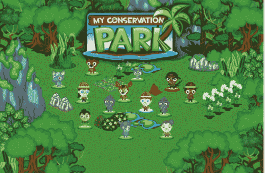
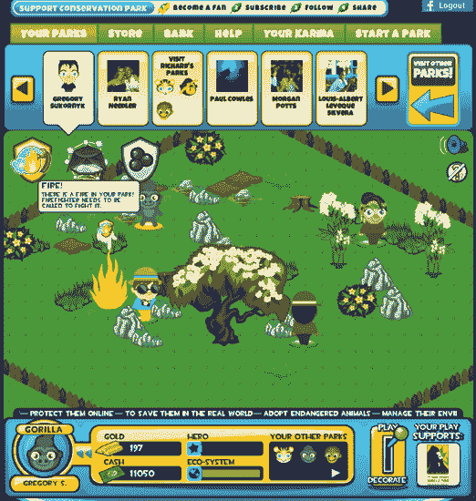

# 美好世界游戏的 MyConservationPark 帮助你拯救濒危物种 TechCrunch

> 原文：<https://web.archive.org/web/http://techcrunch.com/2011/06/19/good-world-games-myconservationpark-helps-you-save-endangered-species/>

# 好世界运动会的 MyConservationPark 帮助你拯救濒危物种

将社交游戏与一项事业相结合已经成为一种流行的方式，让脸书的游戏玩家为各种慈善事业筹集资金。例如，在过去的几年里，Zynga 已经通过其游戏为日本和海地的地震救援工作筹集了资金。初创公司 [Good World Games](https://web.archive.org/web/20230203073106/http://www.goodworldgames.com/) 正在开发脸书游戏，致力于将公益事业的力量与社交游戏的病毒式爆炸结合起来。这家初创公司的第一款脸书游戏 [MyConservationPark](https://web.archive.org/web/20230203073106/http://www.facebook.com/myconservationpark) ，你可以保护濒危动物免受环境和人类的威胁，同时用动植物丰富公园，创造一个可持续的栖息地。

游戏中有 2 种玩法:玩和装饰。在游戏模式中，新的挑战不断出现，你必须克服这些挑战，以拯救和保护你的濒危物种(例如，你的公园着火了，请一名消防员来扑灭它)。在这种模式中，你的生态系统和英雄水平会受到你能否成功克服这些挑战的影响。

在装饰模式下，你可以为你的物种创造一个天堂，并添加人和生物，树木，食物和水，了望塔和棚子，并按照你认为合适的方式安排你的公园。你可以购买虚拟物品，如公园管理员，本地物种，如羚羊，建筑物，如了望塔和营地，植物(本地树木和灌木)，水和昆虫。

所有虚拟物品的购买直接使好世界游戏的非盈利合作伙伴受益，游戏内购买收入的 15%捐赠给精选事业。每个公园受益于不同的合作伙伴，其中包括戴安·福西大猩猩基金，海洋守护者协会，野生救援和猩猩拓展。你还可以看到你的游戏互动收入中有多少是捐赠的。

每个公园都有当地的物种，有不同的艺术和挑战。游戏中的最佳得分者将定期获得现实世界的奖励，如免费旅行，帮助(作为志愿者)该领域的一个非营利合作伙伴。

最终，好世界游戏公司计划推出类似的游戏，让脸书用户玩游戏，为社会谋福利。

