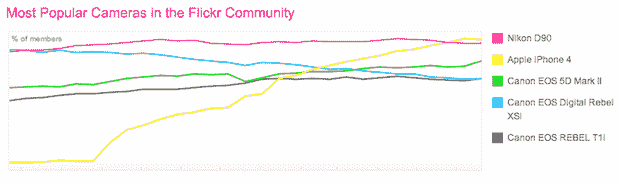

# 是的，Flickr iPhone 的数据差得太远了——它远比看起来更占优势

> 原文：<https://web.archive.org/web/https://techcrunch.com/2011/06/21/flickr-iphone-data/>

今天早些时候， [TUAW 注意到](https://web.archive.org/web/20230404210932/http://www.tuaw.com/2011/06/21/iphone-4-most-popular-camera-on-flickr/)根据 Flickr 的[统计数据](https://web.archive.org/web/20230404210932/http://www.flickr.com/cameras/)，iPhone 4 现在是网站上最受欢迎的相机。是的，它已经超越了所有的专业相机，所有的傻瓜相机等等。那是巨大的。

但是这个消息伴随着一个警告。实际上是一个大问题。

正如 TUAW 在他们的帖子底部指出的，警告是 Flickr 承认他们只能检测到用于拍照的相机“大约 2/3 的时间”。但关键部分是下一句话:“这在照相手机上通常是不可能的，因此它们的代表性不足。”

“通常不可能”。换句话说，iPhone 4 很可能在*长*时间里一直是头号相机。

我们上次在 4 月份查看数据时注意到了这个警告。很可能 iPhone 4 当时已经是顶级相机，而且可能在那之前的一段时间也是如此。查看我自己的 Flickr 照片，我发现过去几个月我通过 Instagram 发送到 Flickr 的任何照片都被去掉了 iPhone 4 标识符。换句话说，基本上我和我认识的其他人最近几个月放在 Flickr 上的所有照片都没有计入这次 iPhone 4 登顶。其他应用程序也会删除这些信息。具体来说，我认为 Flickr 的 iPhone 4 数据*非常低*。

Instagram 的联合创始人凯文·斯特罗姆证实，由于 iOS 的限制，他们无法将 iPhone 4 的元数据传递给 Flickr。是的，它影响了其他 iOS 应用程序。因此，数量非常非常少。他告诉我去最近上传的 Flickr 页面刷新几次，看看新的 Instagram 照片多长时间出现一次。有太多——是的，这些数字相差太远了。

如果 iPhone 4 的价格低，那么其他型号的价格也低。这意味着 Flickr 上第二受欢迎的 iPhone 型号 iPhone 3G 也可能出现在 Flickr 的前 5 名相机中。他们列出的第五款相机是佳能 EOS REBEL T1i，昨天有 3794 名用户。iPhone 3G 昨天有 3168 名用户——但数据还是没有显示。见鬼，我不确定有了正确的数据，iPhone 3G 就不会在榜单上排名第二。

同样的问题可能也适用于安卓手机。尽管出于某种原因，这些数字在 Flickr 上确实很低。根据 Flickr 的数据，最受欢迎的拍照安卓手机是 EVO 4G。但它昨天只有 590 名用户(同样，可能很低)。iPod touch 昨天有 507 名用户(同样很低)。EVO 4G 有一个 800 万像素的摄像头。iPod touch 有一个 70 万像素的摄像头。一个显然是用来作为静态相机。一个不是。真可悲。

是的，我知道个人 iPhone 号码受益于可供选择的型号较少。但纵观其他流行的 Android 机型，很明显所有机型加起来都比不上 iPhones 在 Flickr 上的销量。少报的数字。

与此同时，花点时间在那个[很棒的 iPhone 照片分享应用](https://web.archive.org/web/20230404210932/https://techcrunch.com/2010/12/25/flickr-instagram/)，Flickr 上。你没有足够的数据来证明它的存在。