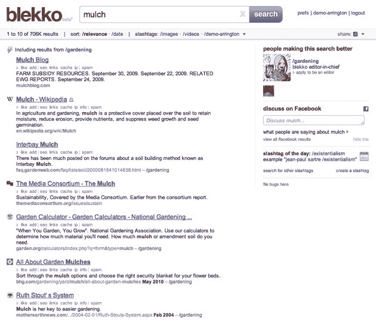

# 通过 Blekko 的佐罗更新削减垃圾邮件！TechCrunch

> 原文：<https://web.archive.org/web/http://techcrunch.com/2011/06/21/slash-through-spam-with-blekkos-zorro-update/>

# 通过 Blekko 的佐罗更新削减垃圾邮件！

好吧，我对标题有点兴奋过头了。但是新版本的搜索引擎 [Blekko](https://web.archive.org/web/20230203090500/http://www.blekko.com/) ，名为 Zorro 并且正在发布，非常酷。视觉上有了很大的改进。之前版本的红色链接和大部分左边栏的混乱都消失了。事实上，左边栏已经不见了，取而代之的是搜索结果旁边的小图标，让你一眼就能看出它们来自哪个网站。

该公司还通过自动搜索大幅增加了搜索相关性，包括约 1，000 个斜杠标签，而以前只有少数几个。这意味着，对于许多搜索结果，你看到的都是那些众所周知拥有高质量内容的精选网站。内容农场就是过不了斜杠标签。

搜索“怀孕提示”，你会看到斜线标签，为/怀孕和/健康，以及相当不错的结果相比，谷歌。但是在布雷克，你还没完。单击其中一个斜杠标签，深入查看与该标签相关的结果。答案相关性更高。在谷歌上，你必须访问结果的下一页，或者重新措辞你的查询。两者都很耗时。

然而，Blekko 最令人惊奇的是它仍然存在。许多雄心勃勃的搜索初创公司，如 Cuil 和 SearchMe，都曾尝试过，但都失败了。但 Blekko 成立 6 个月以来，发展势头良好，每月约有 100 万独立 IP 访问该网站。他们说，早期的上下文广告测试产生了良好的效果。当他们最终把它打开时，一个真正的收入流将流向 Blekko。换句话说，可能是时候开始考虑将 Blekko 作为一个长期的“我们还在这里”的创业公司了。他们还没有失败的迹象。

Blekko 今天发布的另一个东西是一个叫做 3 Engine Monte 的有趣工具。在我的[下一篇文章](https://web.archive.org/web/20230203090500/https://techcrunch.com/2011/06/21/be-the-mark-in-blekkos-3-engine-monte/)中会有更多的介绍。