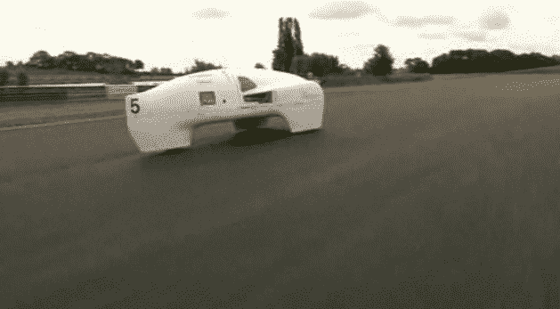
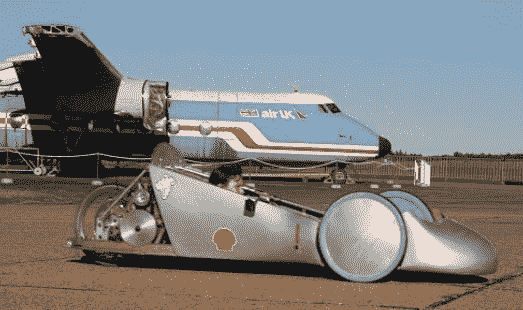

# 这些由孩子们制造的汽车原型每加仑能跑近 2000 英里 TechCrunch

> 原文：<https://web.archive.org/web/http://techcrunch.com/2011/06/25/car-prototypes-kids/>

# 这些由孩子们制造的汽车原型每加仑能跑近 2000 英里

有什么比一辆每加仑能跑一千多英里的汽车更令人印象深刻？一个由学生设计的。

在英国，来自地方学校和大学的学生参加了在英格兰莱斯特附近举行的年度里程马拉松挑战赛，每支队伍都在赛道上争夺新的汽油里程效率纪录。汽车被允许滑行，但必须保持每小时 15 英里的最低速度。学生们制作车辆原型，许多人与设计和工程公司合作。

上图所示的 20 支参赛队伍的获胜者是一辆由 14 岁的萨姆·查普曼·希尔驾驶的汽车，它达到了每加仑 1，980 英里的效率。它的空气动力学设计让人想起科幻电影中的一些东西，重量不到 100 磅，主要由玻璃强化的塑料制成。

一名 11 岁的车手凯蒂·福斯特(Kitty Foster)在一辆使用[剑桥设计合作公司](https://web.archive.org/web/20230204182813/http://www.cambridge-design.co.uk/) [氧气浓缩器](https://web.archive.org/web/20230204182813/http://www.cambridge-design.co.uk/uncategorized/bbc-report-on-cdps-lightweight-oxygen-concentrator/)和微型柴油发动机的模型中完成了她的比赛，每加仑汽油可行驶 1325 英里:

赛车还使用 GPS 进行跟踪，以优化比赛中的策略，当停止发动机并开始滑行的最佳时刻到来时，它会通知 Kitty。那些拥有智能手机的人被鼓励在比赛中追踪汽车的速度和位置。

组织这项挑战是为了激发学生对技术和工程的兴趣，建造的原型不太可能在短期内大规模生产。然而，它们确实展示了什么是可能的，并可能激励汽车制造商不断创新以提高效率。

*图片 via [BBC](https://web.archive.org/web/20230204182813/http://www.bbc.co.uk/news/uk-england-leicestershire-13873369)
帽子提示:[居留地](https://web.archive.org/web/20230204182813/http://inhabitat.com/1325-mpg-hypermiling-car-piloted-by-11-year-old-student/)*