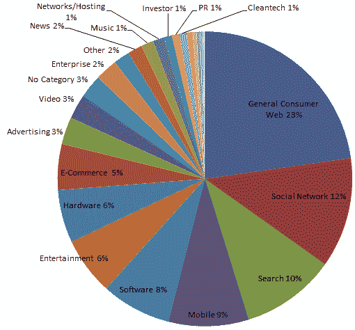
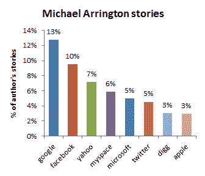
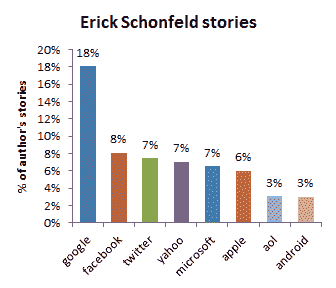
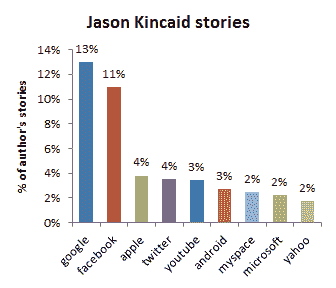
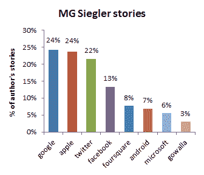

# TechCrunch 的数学，第 2 部分:它有偏好吗？TechCrunch

> 原文：<https://web.archive.org/web/https://techcrunch.com/2011/06/26/math-techcrunch-part-2-favorites/>

***编者按**:此前在[“TechCrunch 的数学，第一部分:TechCrunch 还是关于创业公司的吗？”](https://web.archive.org/web/20230203033742/https://techcrunch.com/2011/06/12/math-of-techcrunch-startups/)客座作者* *[马克·戈登森](https://web.archive.org/web/20230203033742/http://www.goldenson.com/)分析了超过 20，000 篇 TechCrunch 的报道，以找出我们实际上对初创公司和大公司的报道有多少。在这篇文章中，他按照投资者、作者和市场细分进行了深入研究。* *戈登森是[Breakthrough.com](https://web.archive.org/web/20230203033742/http://www.breakthrough.com/)的首席执行官，这是一家帮助人们寻找治疗师和获得在线咨询的初创公司。他的电子邮件是 mark@breakthrough.com 的。*

在我的上一篇文章中，我们了解到，TechCrunch 现在覆盖的初创公司比第一年多了十倍，但现在超过一半的覆盖范围是大公司。在这篇文章中，我将按照投资者、作者和市场来分析这些报道。

这些发现是基于 2005 年 6 月 11 日^日至 2011 年 5 月 11 日^日期间**6308**家公司的 [CrunchBase API](https://web.archive.org/web/20230203033742/http://www.crunchbase.com/help/api) 和**TechCrunch 的**23547 报道。这是我的发现。

**1。**

投资者经常宣称他们的价值不仅仅是金钱。在 CrunchBase 中拥有投资者数据的**2596 家**被调查公司中，有人支持这一观点:

| **排名** | **投资方** | **覆盖的创业公司** |
| **1** | y 组合子 | 121 |
| **2** | 红杉资本 | 103 |
| **3** | 加速伙伴 | 102 |
| **4** | 首轮资本 | 93 |
| **5** | 德雷珀·费希尔·朱韦森 | 87 |
| **6** | 罗恩·康韦 | 80 |
| **7** | 基准资本 | 70 |
| **8** | 英特尔投资 | 70 |
| **9** | 凯鹏华盈 | 70 |
| **10** | 指数风险投资 | 70 |
| **11** | 新企业合作伙伴 | 62 |
| **12** | 查尔斯河风险投资公司 | 57 |
| **13** | 贝塞麦风险投资公司 | 55 |
| **14** | 达戈风险投资公司 | 54 |
| **15** | 创始人基金 | 52 |
| **16** | 格雷洛克 | 51 |
| **17** | 红点风险投资 | 51 |
| **18** | 真正的冒险 | 50 |
| **19** | 500 家创业公司 | 50 |
| **20** | SV 天使 | 49 |

****

这 20 大投资者支持的公司比其他投资者支持的公司平均多获得 2.3 个故事。尽管 Y Combinator 从比大多数公司更多的投资中获益，但它的光环效应尤其强烈:YC 覆盖的公司比红杉多 20%。

然而，筹集的资金并没有增加覆盖面:

| **前 10 名最蒙** |  |  | **十大最受资助** |  |
| **公司** | **募集总额** | **故事** |  | **公司** | **募集总额** | **故事** |
| 谷歌 |  $25,100,000 | 3069 |  | Clearwire |  $5,620,000,000 | 5 |
| 脸谱网 |  $2,335,700,000 | 1961 |  | 脸谱网 |  $2,335,700,000 | 1961 |
| 推特 |  $360,166,000 | 1675 |  | 德纳 |  $2,208,000,000 | 15 |
| 苹果 |  | 1656 |  | 索林德拉 |  $1,643,200,000 | 1 |
| 微软 |  | 1007 |  | 大地之力 |  $1,200,000,000 | 1 |
| 美国 Yahoo 公司(提供互联网的信息检索服务) |  | 912 |  | Groupon |  $1,137,000,000 | 172 |
| 安卓 |  | 563 |  | 天狼星。亦称 DOG STAR |  $1,055,750,000 | 4 |
| 聚友网（网站） |  | 494 |  | 菲斯克 |  $1,018,000,000 | 1 |
| 油管（国外视频网站） |  $11,500,000 | 448 |  | 美国境内提供线上加值网络服务的公司(American On Line) |  $1,003,000,000 | 327 |

只有脸书是最受关注的公司之一，也是资金最多的公司之一。当所有被覆盖的公司都根据其融资情况绘制图表时，衡量覆盖率和融资之间相关性的 R 平方值仅为 0.04/1，表明融资额不会强烈影响覆盖率。

(苹果、微软[、以及其他几家顶级公司的融资并不容易获得，但据报道不到 10 亿美元。这不包括首次公开募股的公共融资；因为 CrunchBase 有数百家很少被覆盖的上市公司，所以结果可能不会有很大不同。)](https://web.archive.org/web/20230203033742/http://www.quora.com/How-much-venture-capital-did-Microsoft-raise)

**2。** **TechCrunch 的作家们确实偏心眼**

在过去的六年里，TechCrunch 的作家数量增加了五倍。随着时间的推移，这些是最多产的作家(有些已经不在 TechCrunch 工作了):

| **作家** | **故事** |
| 迈克尔·阿灵顿 | 4079 |
| 埃里克·舍恩菲尔德 | 3076 |
| 琳娜·拉奥 | 2705 |
| MG 西格勒 | 2649 |
| 罗宾·沃特斯 | 2502 |
| 杰森·金凯 | 2261 |
| 邓肯·赖利 | 838 |
| 亚历克西亚·措特西斯 | 827 |
| 马克·亨德里克森 | 479 |
| 尼克·冈萨雷斯 | 344 |
|  |  |

TechCrunch 的读者有时会抱怨作家偏爱某些公司。数据支持这一点吗？

有点吧。

所有 TechCrunch 作者发表的关于十家左右大公司的报道最多，一篇报道往往涵盖多家公司。在这些顶级公司中，一些作家确实有自己的最爱，有一个数据点很突出:MG Siegler 三分之二的帖子都是关于谷歌、苹果和 Twitter 的。MG 对 Twitter 的报道是其他作家的两倍，对苹果的报道是其他作家的三倍。(他的图表中的百分比加起来超过 100，因为多家公司经常在同一篇文章中被贴上标签)。

**3。** **TechCrunch 报道 Chatroulette 超过五家价值十亿美元的创业公司总和**

CrunchBase 对公司的市场进行分类，毫不奇怪，TechCrunch 覆盖最多的公司被标记为普通消费者网络。这包括雅虎和美国在线等门户网站，Mozilla 和 Chrome 等浏览器，以及其他非特定市场。接下来最受欢迎的市场是社交网络、搜索和移动。CrunchBase 的分类数据是杂乱的，像苹果这样的大公司可以有几种分类方式，所以这些数据并不精确(见顶部的饼状图)。

有一个发现值得注意:**只有 2%的 TechCrunch 报道是关于企业的**。网络上的许多热门人物都是性感的消费者游戏，但 TechCrunch 对五家独立的十亿美元企业初创公司——Atlassian(9 个故事)、Palantir (7 个故事)、ExactTarget (7 个故事)、Workday (5 个故事)和 Service-Now (1 个故事)——的覆盖面小于其对 Chatroulette 的阴茎花园(36 个故事)的覆盖面。

我认为这很不幸。这些公司有很好的故事。Atlassian 的资金来源于 1 万美元的信用卡债务。Palantir 正在使用数据分析来捕捉恐怖分子。Workday 创始人大卫·达菲德，收养了六个孩子的 PeopleSoft 的亿万富翁创始人，在甲骨文的恶意收购中失去了 PeopleSoft。Workday 现在与他以前的企业竞争，并在不到五年的时间里成为一家价值十亿美元的公司。

我知道这些产品被认为很无聊，但无聊的业务往往是更好的业务，新闻艺术的一部分就是让无聊变得性感。

*披露:[Breakthrough.com](https://web.archive.org/web/20230203033742/http://www.breakthrough.com/)总部位于 TechCrunch 母公司 AOL 的孵化器内。*