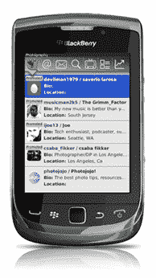

# 在 Seesmic 向 RIM 告别之际，UberMedia 为黑莓 TechCrunch 推出了 UberSocial 1.2

> 原文：<https://web.archive.org/web/https://techcrunch.com/2011/06/28/as-seesmic-bids-adieu-to-rim-ubermedia-introduces-ubersocial-1-2-for-blackberry/>

# 随着 Seesmic 向 RIM 告别，UberMedia 为黑莓推出了 UberSocial 1.2

广受欢迎的 [UberSocial](https://web.archive.org/web/20230204124700/http://ubersocial.com//) Twitter 客户端[用于黑莓](https://web.archive.org/web/20230204124700/http://ubersocial.com/blackberry/)(之前被称为 UberTwitter)刚刚[获得了更新](https://web.archive.org/web/20230204124700/http://www.businesswire.com/news/home/20110628005785/en/UberMedia-Launches-UberSocial-1.2-BlackBerry-%E2%80%9CInner-Circle%E2%80%9D)，增加了一系列[新功能](https://web.archive.org/web/20230204124700/http://www.berryreview.com/2011/06/22/ubersocial-v1-2-released-with-new-features-and-bug-fixes/)和漏洞修复。

值得注意的是，它的开发者 [UberMedia](https://web.archive.org/web/20230204124700/http://www.crunchbase.com/company/ubermedia) 在它的竞争对手 [Seesmic](https://web.archive.org/web/20230204124700/http://www.crunchbase.com/company/seesmic) 、[放弃](https://web.archive.org/web/20230204124700/https://techcrunch.com/2011/06/20/seesmic-bails-blackberry/)黑莓平台[的同时，也在加倍开发它的黑莓应用。](https://web.archive.org/web/20230204124700/http://blog.seesmic.com/important-update-for-blackberry-users.html)

UberSocial for Blackberry 1.2 的一个新功能叫做“内圈”，基本上可以让你将你关注的最重要的人群放在一个专属的时间线中，与传统的时间线并排。

用户还可以为他们“核心圈子”中的任何人的推文、回复或直接消息设置特殊通知。

其他新功能包括“主题引擎”，可以创建个性化的主题和“交易箱”，允许用户获得基于位置的交易通知。

通过升级应用程序，UberMedia 还满足了 Twitter 关于 OAuth 认证的要求。在 6 月 30 日之前没有升级到新版本的用户将不再能够访问他们的直接消息。

郑重声明:黑莓有官方的 [Twitter 应用](https://web.archive.org/web/20230204124700/http://twitter.com/#!/download/blackberry) [(由 RIM 公司开发)。](https://web.archive.org/web/20230204124700/http://appworld.blackberry.com/webstore/content/8160?lang=en)