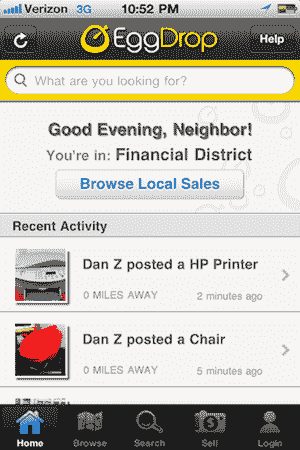
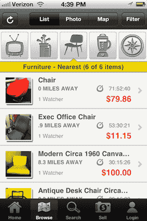

# EggCartel 通过快速移动的 EggDrop(和资金)TechCrunch 让 Craigslist 看起来更加古老

> 原文：<https://web.archive.org/web/http://techcrunch.com/2011/06/28/eggcartel-eggdrop/>

当你访问 Craigslist 时，就好像你在访问 90 年代早期的网站。蓝色链接。就是这样。一方面，你必须欣赏简单性(和速度)。另一方面，WTF？现在是 2011 年。

过去，许多竞争对手曾试图颠覆 Craigslist，但都以惨败告终。但有理由相信，由于一个关键因素:移动，这个领域颠覆的时机已经成熟。这正是鸡蛋卡特尔的目标。

他们的第一款产品 EggDrop 今天在 iPhone 上发布，明天在 Android 设备上发布。你可以把它想象成一种把 Craigslist 放在你口袋里的方式，但是这种方式更加可视化。甚至更注重位置。最重要的是，它更容易添加项目。

这真的是 EggDrop 的关键。添加物品就像用手机拍一张照片，设定价格，然后上传一样简单。你可以添加一个标题和其他细节，但是 EggDrop 会在后台为你的产品分类。从那里，它被列在一个基于位置的目录中，应用程序可以访问该目录。用户寻找他们感兴趣的商品，可以观察它们的价格如何波动，或者可以立即出价。这是荷兰式拍卖，所以如果没有人出价，价格会随着时间的推移而下降。

位置在 EggDrop 中起着巨大的作用，因为不允许运输。每一项买卖都必须在当地完成。因此，如果你看到一辆自行车出售，你知道它离你相对较近，你必须去取车(或让卖家把它放下)。“位置不仅仅是你居住或工作的地方，而是你在任何给定时间的位置。联合创始人郑丹说:“也许你家附近没有《星球大战》的人偶，但你去了洛杉矶，它就在那里。”。

考虑到这种人际互动，EggDrop 也在做一些有点老派的事情——他们把交易留给买家和卖家来处理。没错，app 内部没有花哨的支付系统。当你买东西时，你用现金、支票、PayPal 或信用卡(如果卖家有类似 Square 的东西)来完成。他们正在考虑未来在应用内处理支付的合作伙伴关系。

那么他们如何避免垃圾邮件和欺诈呢？分级系统是 EggDrop 的关键。一旦你买了和/或卖了一件东西，你就反馈了那次经历。如果一个人被标记为怪人(他们说他们会买，但从来没有出现过)或销售柠檬，这个评级会一直伴随着他们。就像易贝一样，我们的目标是建立一个强大的信誉系统，主要由用户来维护，让他们可以信任。

我们第一次报道 EggCartel 是在去年年底，当时他们是 AngelPad 最初的公司之一。从那时起，他们一直在与不到 100 人进行私人阿尔法测试。但创始人指出，事情进展得非常顺利，现在他们有足够的信心向所有美国用户开放。与此同时，他们意识到由于缺少列出的项目，事情开始时可能会有点慢，所以他们创建了一个愿望列表功能。如果你正在寻找的东西还没有列出，你可以将它添加到你的列表中，当你附近有这样的项目时，你会收到通知。

郑和联合创始人预计，大多数人首先会使用 EggDrop 来销售电子产品、家具、儿童用品和类似的东西。但他们指出，已经在他们的网站上进行有限的测试，他们已经卖出了几辆车。

就盈利而言，EggCartel 不会做明显的事情来抽取销售额(因为他们并不参与实际销售)，相反，他们会专注于随着时间的推移增加优质功能。但那都是未来的事。目前，他们只想获得用户。

为此，EggCartel 向 TechCrunch 读者提供了一份价值 5 美元的礼物(以亚马逊礼品卡、iTunes 礼品卡或向红十字会捐赠的形式)，前提是你在周五中午之前列出 5 件商品。要申领这份礼物，只需在点击你列出的 5 个项目时，从应用程序中给 techcrunch@eggcartel.com 发电子邮件(帐户= >销售= >促销= >电子邮件)。

这个七人小组今天还有一个令人兴奋的消息:资金。EggCartel 刚刚完成了由 SV Angel 和 BlueRun Ventures 牵头的 100 万美元种子轮投资。三一投资公司和查尔斯河投资公司也参加了。

你可以在 App Store [这里](https://web.archive.org/web/20230203040736/http://itunes.apple.com/us/app/eggdrop-your-neighborhood/id442784113?mt=8)找到 EggDrop。明天在安卓市场找吧。

 