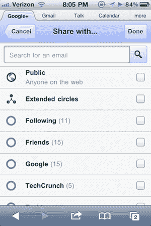

# 在我们等待原生应用的时候，Google+ iPhone 移动网络应用已经相当稳固了

> 原文：<https://web.archive.org/web/https://techcrunch.com/2011/06/28/google-plus-iphone-web-app/>

# 在我们等待原生应用的时候，Google+ iPhone 移动网络应用已经相当稳固了

在今天的盛大发布会之后，一些有幸获得 Google+邀请的人仍然受到了冷落:iPhone 用户。你看，虽然谷歌+安卓应用程序在第一天就准备好了，但苹果仍在审查 iPhone 应用程序。但是不要担心 iPhone 用户，有一个你可能不知道的小秘密:一个在 Safari 上运行良好的移动网页版 Google+。

如果你简单地将你的 iOS Safari 浏览器指向[plus.google.com](https://web.archive.org/web/20230407065501/http://plus.google.com/)，你会发现一个用 HTML5 编写的可靠的网络应用。你不能用原生应用做所有你能做的事情，比如 Huddle(群聊)。但是 Google+功能的主要部分在那里。流、照片、圈子、个人资料和通知出现在主菜单中。

实际上还有一些其他独特的功能，例如可以在某个地点签到，并看到来自您当前位置附近用户的 Google+消息。

这款应用足够强大，如果它真的能发出通知，那么作为原生应用的替代品也是可以接受的。唉，那是不可能的。这将是 Google+ iPhone 应用程序的重要组成部分，尤其是在 iOS 5 中改进的通知功能。有一些移动网络通知非常漂亮(右上角有一个红框)，但显然你必须打开应用程序才能看到它们。

下面，找几张图。

 

 