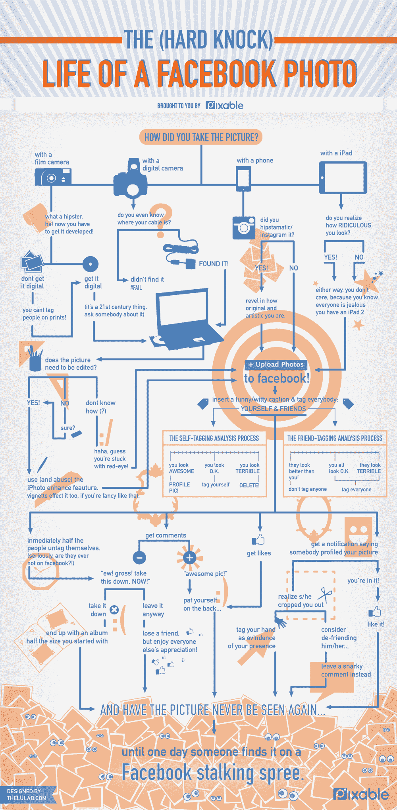

# Pixable 的“脸书照片的生活”(信息图)

> 原文：<https://web.archive.org/web/http://techcrunch.com/2011/06/28/pixables-life-of-a-facebook-photo-infographic/>

# Pixable 的“脸书照片的生活”(信息图)

很难打败我的同事 Alexia Tsotsis' witty ' [我应该用什么手机照片分享应用程序'](https://web.archive.org/web/20230204061102/https://techcrunch.com/2011/06/15/what-photo-sharing-app-should-you-use/)信息图。今天， [Pixable，](https://web.archive.org/web/20230204061102/http://www.pixable.com/)一家为脸书和其他照片分享网站开发时尚的社交照片创建和分类工具的初创公司，发布了自己的[照片分享信息图](https://web.archive.org/web/20230204061102/http://www.pixable.com/blog/2011/06/28/the-facebook-photo-uploading-process-infographic/)，专注于照片分享和照片在脸书的“艰难”生活。

Pixable 的[服务](https://web.archive.org/web/20230204061102/https://techcrunch.com/2011/04/22/social-photo-aggregator-pixable-raises-3-6-million/)拥有 80 万用户，允许人们使用他们所有的脸书和图片分享网站照片内容，如标题、标签信息、评论和生日，来制作相册、幻灯片、日历或艺术品。Pixable 基于浏览器的功能简化了相册的创建，任何人都可以轻松使用。Pixable 的早期应用之一是一个漂亮的工具，可以让你为你的脸书照片制作马赛克。

根据你是用胶片相机、数码相机、手机还是新版 iPad 拍照，这张信息图展示了一张脸书照片的生活。

Pixable 最近还对脸书的个人资料照片进行了数据分析，发现 10%的脸书照片是个人资料照片。自 2006 年以来，每位用户上传的个人资料照片数量增加了两倍。平均而言，典型的个人资料照片有 2 个赞和 2 条评论。

