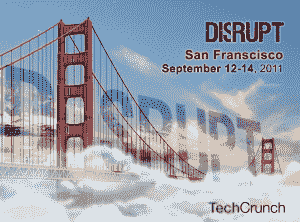

# 让游戏开始，TechCrunch 扰乱 SF 启动战场应用程序现已开放！TechCrunch

> 原文：<https://web.archive.org/web/https://techcrunch.com/2011/06/28/techcrunch-disrupt-sf-startup-battlefield-applications/>

# 让游戏开始，TechCrunch 扰乱 SF 启动战场应用程序现已开放！

 现在我们终于从[在纽约](https://web.archive.org/web/20221205180920/http://disrupt.beta.techcrunch.com/NYC2011/)的扰乱中缓过气来，是时候把扰乱带回旧金山老家了。(我们喜欢让这里的一切保持运转)。为了让事情顺利进行，我们接受创业公司的申请，将于 2011 年 9 月 12 日至 14 日在旧金山的 Disrupt Startup 战地启动。你还在等什么？启动战场的申请可以从今天开始[提交](https://web.archive.org/web/20221205180920/http://apply.tcdisrupt.com/)。

你认为你的创业公司会成为下一个 [Getaround](https://web.archive.org/web/20221205180920/https://beta.techcrunch.com/2011/05/25/and-the-winner-of-techcrunch-disrupt-nyc-is-getaround/) 、 [Qwiki](https://web.archive.org/web/20221205180920/https://beta.techcrunch.com/2010/09/29/qwiki-techcrunch-disrupt-winner/) 或[Soluto](https://web.archive.org/web/20221205180920/https://beta.techcrunch.com/2010/05/26/techcrunch-disrupt-winner-soluto/)——并通过评委的挑战，获得 5 万美元的最高奖金、“Disrupt Cup”和观众的赞誉吗？当然可以。但是你永远不会知道，除非你申请。

Disrupt 是首个创业启动竞赛，最有前途的创始人和企业家在全明星评委面前，在技术的最大舞台上竞争启动他们的公司。我们将邀请一些最有影响力的创新者、天使投资人和风险投资人在 2000 名投资者、技术专家和媒体面前进行评判。

申请将于 7 月 31 日截止。所以不要等了。现在就申请吧。申请将在滚动的基础上被审查，所以一旦你准备好了就提交你的申请是对你有利的。由于这种强烈的需求，我们不能审查申请超过一次，所以请不要提交申请草案之前，你已经准备好了最后的考虑。申请过程中需要一段视频。我们不会接受任何超过 5 分钟的视频，它们不应超过 50MB。在视频中，请务必向我们展示产品、其主要特性以及与众不同之处。如果被选中，我们可能会在 Disrupt SF 的创业战场比赛中使用提交的视频片段。申请人还需要附上一份最多 5 张幻灯片的文件，以总结和强化申请。不要担心，所有提交的内容都是保密的。

为了在创业战场上竞争，将优先考虑那些将首次向公众和媒体发布的秘密创业公司。提交申请时，所有初创公司的运营时间必须少于三个月。比赛将在旧金山举行，但我们欢迎来自世界各地的公司参加，我们也非常鼓励他们这样做。已经在其他公开发布会上展示过的公司没有资格。

请务必通读所有的[规则，并在提交](https://web.archive.org/web/20221205180920/http://disrupt.beta.techcrunch.com/NYC2011/battlefield/)之前看一眼来自纽约州的决赛选手。

[Disrupt SF](https://web.archive.org/web/20221205180920/http://disrupt.beta.techcrunch.com/SF2011/) 将于 9 月 12 日至 14 日举行，在此之前，我们广受欢迎的[黑客马拉松](https://web.archive.org/web/20221205180920/http://disrupt.beta.techcrunch.com/NYC2011/hackathon/)将于 9 月 10 日至 11 日举行。

如果你是一家早期公司，不想进入创业战场竞争，或者没有资格，你仍然可以在 Startup Alley 推出和演示你的创业公司或新产品。如果你选择这样做，你有机会在 Disrupt 的第一天或第二天赢得“观众选择”，这也让你有机会在 Disrupt 舞台上面对我们的全明星评委。注册 Startup Alley 的初创公司必须成立不到两年，筹集的资金不超过 200 万美元。你可以在这里看看《创业小巷》中我们最喜欢的一些瞬间，在这里看看《创业小巷》的观众选择冠军之一[快乐玩具机](https://web.archive.org/web/20221205180920/http://www.crunchbase.com/company/happy-toy-machine) [。确保您的](https://web.archive.org/web/20221205180920/https://beta.techcrunch.com/2011/05/23/happy-toy-machine-allows-you-to-build-your-own-plush-toys/)[注册了](https://web.archive.org/web/20221205180920/http://techcrunchdisrupt2011sfstartupalley.eventbrite.com/)。

如果你想参加扰乱旧金山，早鸟票现在出售。最优惠的价格只在非常有限的时间内提供，所以请务必在这里尽快拿到您的门票。