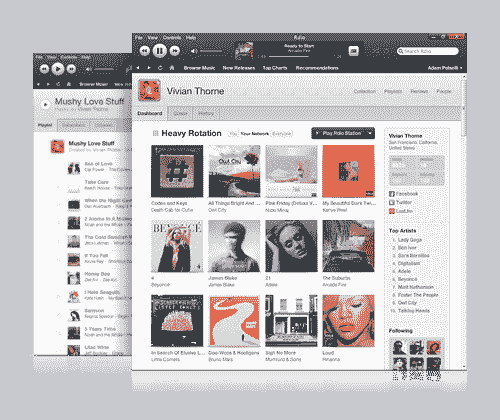
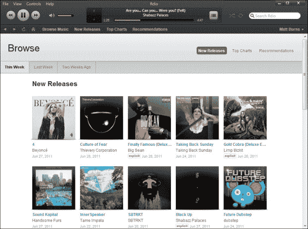

# 随着 Spotify 即将在美国推出，Rdio 推出了一款原生 Windows 应用 TechCrunch

> 原文：<https://web.archive.org/web/http://techcrunch.com/2011/06/29/as-spotify-nears-u-s-launch-rdio-launches-native-windows-app/>

# 随着 Spotify 即将在美国推出，Rdio 推出了一款原生 Windows 应用

作为一个不以为耻的 Windows 用户和 Rdio 的忠实粉丝，[这个](https://web.archive.org/web/20230203044631/http://blog.rdio.com/post/7055557556/now-available-rdio-for-windows)让我很开心。 [Rdio](https://web.archive.org/web/20230203044631/http://www.crunchbase.com/company/rdio) 通过为 Windows XP、Vista 和 7 开发的[原生应用程序扩展了其产品套件。](https://web.archive.org/web/20230203044631/http://www.rdio.com/#/apps/windows/)

公平地说，我可能不会经常使用桌面应用程序，因为我主要在手机和 iPod touch 上使用 Rdio，以及通过我的 Sonos 系统使用[。](https://web.archive.org/web/20230203044631/https://techcrunch.com/2011/01/06/rdio-sonos/)

但是有选择是很好的——我一直抱怨 Spotify 没有一个基于浏览器的应用程序，因为我喜欢将我运行的桌面应用程序的数量保持在绝对最低水平。iTunes 桌面应用程序(至少是 Windows 桌面应用程序)几乎无法使用，至少在我的经验中是这样。

在我离题太远之前:现在有一个用于 Windows 的原生 Rdio 应用程序。

它有点问题(例如，音量滑块不能正常工作),据我的同事 Matt Burns 说，它会让你的电脑慢下来——尽管我个人在运行该软件时没有遇到任何性能问题——但总的来说，它是 Rdio [应用程序系列](https://web.archive.org/web/20230203044631/http://www.rdio.com/#/apps/)的一个受欢迎的补充。

您可以使用该软件来听音乐和管理您的 Rdio MP3 下载，使用键盘的媒体键来控制您的音乐播放器，通过“新发布”、“排行榜”和“推荐”来发现音乐，并与您现有的音乐收藏进行匹配，以查看 iTunes 或 Windows Media Player 库中的哪些音乐在音乐初创公司的目录中。

是的，Mac 用户，实际上从 2011 年 3 月开始，也有一个为你准备的本地应用。

与此同时，Spotify 正在[为在美国推出](https://web.archive.org/web/20230203044631/https://techcrunch.com/2011/06/08/the-stars-align-for-spotify-really-this-time-maybe/)做准备，尽管不可否认它在过去几十年(好吧，几年)一直在为此做准备。坊间传言《T2》将于 7 月中旬上映。

Rdio 只是给了你一个尝试它们的理由，而你却在等待它发生。

